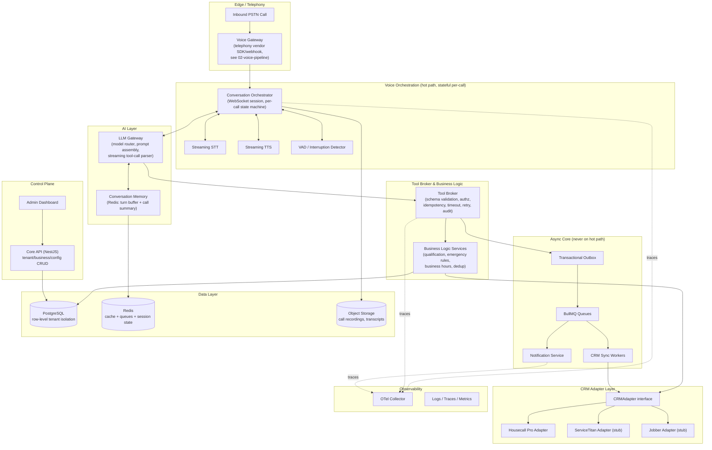
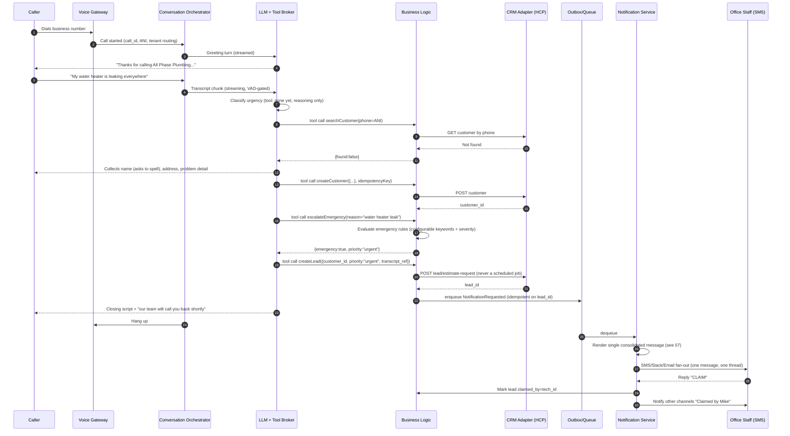
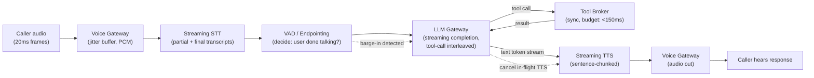
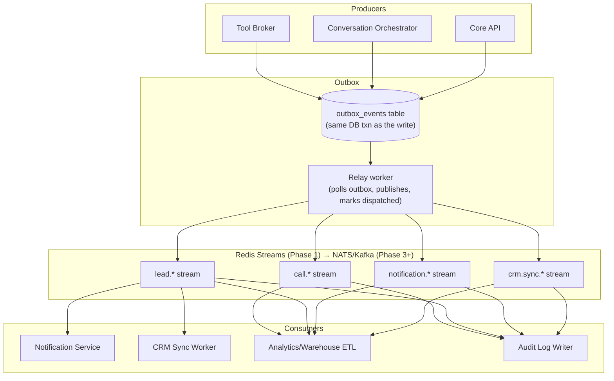
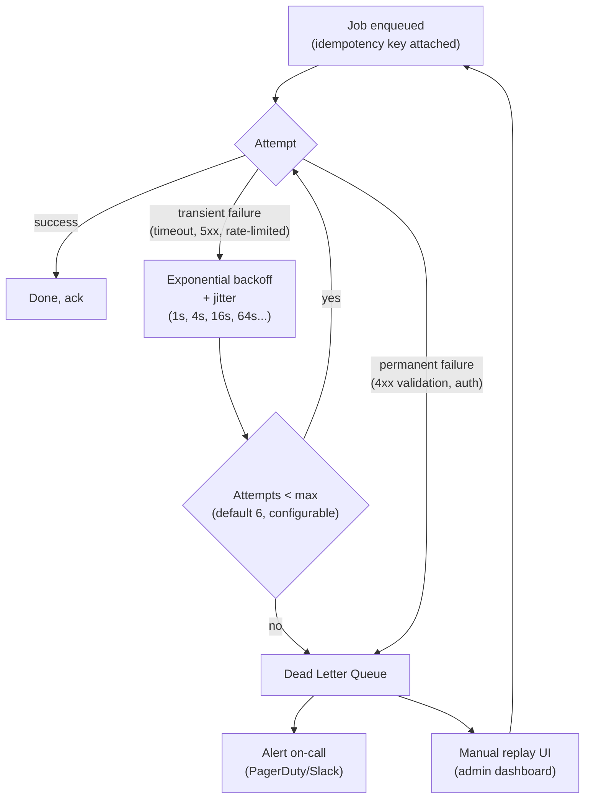
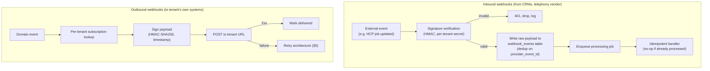
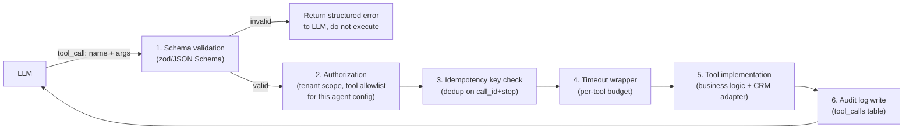
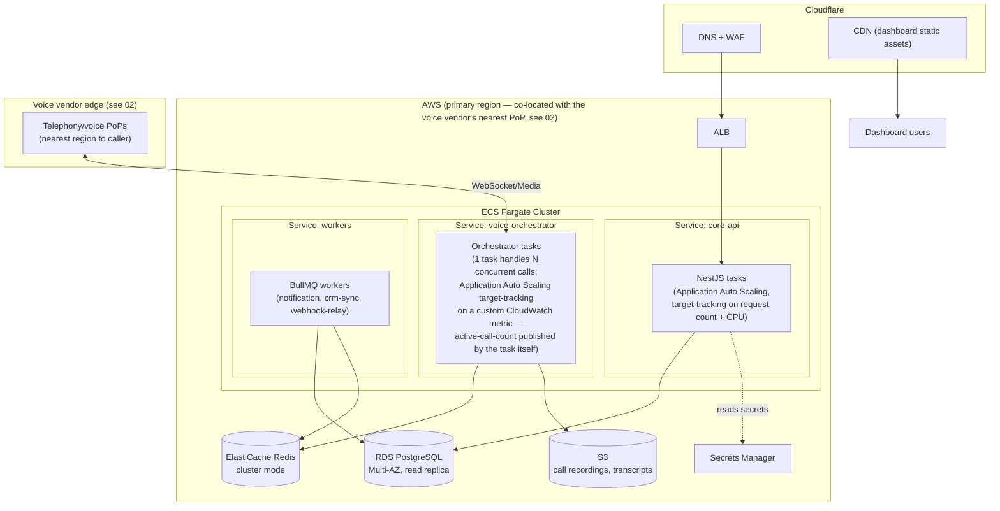
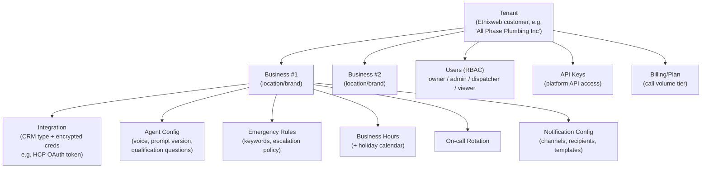

# 01 — System Architecture Overview

## 1. Design principles

Every decision below is constrained by nine non-negotiables:

1. **Multi-tenant from day one.** A `tenant` (an Ethixweb customer, e.g. "All Phase Plumbing") can own multiple `businesses` (locations/brands). No table, cache key, queue message, or log line may omit a `tenant_id`. All Phase is tenant #1, not a hardcoded identity.
2. **No hardcoded business logic.** Emergency keywords, business hours, escalation rules, notification channels, CRM choice, voice/LLM/TTS vendor, prompts, and qualification questions are all rows in config tables or versioned JSON documents, never code constants.
3. **The AI never schedules a job.** Every code path that touches a calendar or dispatch system is physically absent from the AI's tool surface (see [04-ai-tool-architecture.md](04-ai-tool-architecture.md)). This is enforced by the tool broker, not by prompt instructions alone — prompts are not a security boundary.
4. **CRM-agnostic core.** The conversation engine and business logic depend on a `CRMAdapter` interface, never on Housecall Pro's API shape directly. HCP is the first adapter; ServiceTitan/Jobber/Service Fusion/FieldEdge are adapters implemented later against the same interface (see [05-crm-integration.md](05-crm-integration.md)).
5. **Everything latency-critical is on the hot path; everything else is async.** Only STT → LLM → TTS is allowed to block the caller. CRM writes, notifications, and analytics happen off the hot path via an outbox + queue, so a slow CRM API never adds dead air to a call.
6. **Idempotent by construction.** Every external write (create customer, create lead, send notification) carries a caller-generated idempotency key derived from the call ID + logical step, so retries after a crash or timeout can never double-create.
7. **Observable by construction.** Every service emits OpenTelemetry traces with `tenant_id`, `call_id`, and `conversation_turn_id` as span attributes, so a single call can be reconstructed end-to-end from the trace alone.
8. **Fail toward a human, never toward silence.** Any unrecoverable error in the voice pipeline triggers a graceful, scripted handoff/voicemail path — never a dropped call.
9. **Configuration is layered, not duplicated.** Precedence is `business override > tenant default > platform default`. A new tenant works with zero config by inheriting platform defaults; a mature tenant can override anything down to a single emergency keyword.

## 2. High-level component architecture

**Why this shape:** the only components on the caller's critical path are the Voice Gateway, Conversation Orchestrator, STT/TTS, VAD, LLM Gateway, and Tool Broker's _validation_ step. Anything that writes to a CRM, sends a notification, or persists analytics is handed to the outbox and picked up by a worker — the caller never waits on a third-party API.

## 3. Sequence: inbound call → qualified lead → office notified → claimed

## 4. Data flow: latency-critical voice path

Target end-to-end budget (caller stops talking → caller hears first response audio): **under 1000ms**. Full budget breakdown and how each stage hits its number is in [02-voice-pipeline-and-telephony.md](02-voice-pipeline-and-telephony.md).

## 5. Event flow (domain events, decoupled from hot path)

**Why an outbox instead of publishing directly from request handlers:** a transactional outbox guarantees the domain write (e.g. "lead created" row in Postgres) and the event that announces it are atomic — one commits, both exist; one rolls back, neither does. Publishing directly to a broker inside a request handler risks the classic dual-write bug (DB commit succeeds, broker publish fails, downstream never notified — or vice versa, notified about a write that then rolled back).

**Why Redis Streams first, not Kafka/NATS on day one:** at the traffic this platform runs at for its first 12–18 months (see [09-cost-analysis.md](09-cost-analysis.md) — even 10,000 calls/day is ~7 events/minute sustained), Redis Streams with consumer groups gives ordered, at-least-once, replayable delivery with zero new infrastructure, since Redis is already required for session state and BullMQ. Migrating the outbox relay's publish target to Kafka/NATS later is a one-file change because consumers only depend on the stream abstraction, not Redis specifically.

## 6. Retry architecture

Applies uniformly to: CRM writes, outbound notifications, outbound webhook deliveries. A **circuit breaker** wraps each external dependency (per-tenant, per-CRM-adapter) so a CRM outage degrades to "queue and retry later" instead of every call in the system blocking/timing out against a dead API — see [08-security-observability-reliability.md](08-security-observability-reliability.md) §3.

## 7. Webhook architecture

Inbound webhook idempotency is enforced by a unique constraint on `(provider, provider_event_id)` — a replayed delivery (all major CRMs and telephony vendors are at-least-once) is detected at the DB layer and short-circuited before any business logic runs.

## 8. AI tool-calling architecture (summary — full spec in 04)

The LLM's _entire_ capability surface is this fixed tool list — there is no generic "call any API" or "run SQL" tool. Scheduling/dispatch endpoints are not merely unauthorized for the AI's role, they do not exist in the tool registry at all, so a prompt-injection attempt from a caller cannot socially-engineer the model into calling a tool that isn't there.

## 9. Deployment architecture

**Revised after critical review — see [20-architecture-decision-records.md](20-architecture-decision-records.md) ADR-006.** The original draft of this document specified Kubernetes (EKS) from day one. On review, that's over-engineering for a Phase 1 single-tenant pilot: EKS brings real, ongoing operational tax (cluster upgrades, IAM-for-service-accounts wiring, a Prometheus-adapter for custom-metric HPA, Helm chart maintenance) that has to be paid _before_ the product has proven itself, by a team that at Phase 1 is not yet large enough to have a dedicated platform engineer carrying that load. The custom-autoscaling and graceful-drain requirements that motivated EKS are **not actually EKS-exclusive** — both are achievable on plain ECS Fargate (Application Auto Scaling supports custom CloudWatch metrics as a target-tracking source, and ECS's `deploymentConfiguration` + a `SIGTERM` handler that stops accepting new calls but lets in-flight ones finish achieves the same drain behavior as a Kubernetes `PodDisruptionBudget`). The revised recommendation is **Fargate-first, with a defined, evidence-based trigger for migrating to EKS later** — not EKS avoided forever, just not paid for before it's earned.

- **Region strategy:** single primary region at launch (co-located with the chosen voice vendor's nearest PoP to minimize network hop latency — see [02-voice-pipeline-and-telephony.md](02-voice-pipeline-and-telephony.md)); multi-region strategy (active-passive today, active-active later) is designed in [17-disaster-recovery-multi-region-compliance.md](17-disaster-recovery-multi-region-compliance.md), triggered by tenant geographic distribution, not by a fixed calendar date.
- **Why Fargate over EKS for Phase 1-2:** every requirement that looked EKS-specific (custom-metric autoscaling, graceful connection draining for long-lived voice-orchestrator WebSocket sessions, blue/green deploys) has a native ECS equivalent, at meaningfully lower operational overhead for a team this size. Concretely: Application Auto Scaling reads a custom CloudWatch metric (`ActiveCallCount`, published by the voice-orchestrator task itself via the CloudWatch SDK) the same way an HPA reads a Prometheus adapter; ECS `deploymentConfiguration` with `minimumHealthyPercent`/`maximumPercent` plus a task-level `SIGTERM` handler that stops accepting new calls but lets in-flight ones finish achieves the same drain semantics as a `PodDisruptionBudget` (detailed sequence in [10-deployment-cicd.md](10-deployment-cicd.md) §3); and CodeDeploy's blue/green ECS deployment type is a managed, off-the-shelf version of the same pattern.
- **The honest trade-off, and the migration trigger** (documented so this isn't a decision made once and never revisited): Fargate is less flexible than Kubernetes for workload-colocation patterns (sidecars, a service mesh, running non-container workloads like a future self-hosted LiveKit SFU node pool with GPU/specialized networking requirements) and has a smaller ecosystem of off-the-shelf operators. **Migrate to EKS when any of these becomes true**, not preemptively: (1) self-hosting the LiveKit SFU for cost control at volume ([09-cost-analysis.md](09-cost-analysis.md) §4) requires infrastructure patterns Fargate can't express cleanly; (2) the platform team grows to the point where a dedicated platform/DevOps engineer can own cluster operations as their primary job; (3) a service mesh (mTLS everywhere, fine-grained traffic policy) becomes a genuine compliance requirement rather than a nice-to-have. Because the application layer is containerized either way and doesn't call AWS/Fargate-specific APIs directly (the NestJS/voice-orchestrator code has no knowledge of its own orchestrator), this migration is an infrastructure/Terraform+Helm change, not an application rewrite — the Hexagonal Architecture boundary in [14-backend-stack-and-code-standards.md](14-backend-stack-and-code-standards.md) §2 keeps orchestration choice out of the domain and application layers entirely.

## 10. Multi-tenant SaaS architecture

**Isolation model (Phase 1 → Phase 2 progression):**

| Layer       | Phase 1 (few tenants)                                                                                                                                      | Phase 2+ (scale)                                                                                                             |
| ----------- | ---------------------------------------------------------------------------------------------------------------------------------------------------------- | ---------------------------------------------------------------------------------------------------------------------------- |
| Database    | Single Postgres, `tenant_id` column + Postgres **Row-Level Security** policies on every table (defense in depth, not just app-layer `WHERE tenant_id = ?`) | Same, optionally sharded by tenant_id range once a single Postgres instance saturates                                        |
| Redis       | Key-prefixed by `tenant_id`                                                                                                                                | Same; consider per-large-tenant Redis DB index for noisy-neighbor isolation                                                  |
| Compute     | Shared pods, no isolation                                                                                                                                  | Same (compute isolation isn't the bottleneck; a noisy tenant is throttled by per-tenant rate limits, not by dedicating pods) |
| Secrets     | Per-tenant CRM credentials encrypted at rest (KMS envelope encryption), never in plaintext config                                                          | Same                                                                                                                         |
| Rate limits | Per-tenant token bucket at the API gateway and at the tool broker (e.g. max concurrent calls, max tool calls/min)                                          | Same, tunable per billing plan                                                                                               |

Row-Level Security is specified even for Phase 1 because retrofitting it after tenant data already commingled in application-layer-only queries is one of the highest-risk migrations a multi-tenant SaaS can attempt; it costs nothing to enable from the first migration.

## 11. Document map

| Doc                                                                                  | Covers                                                 |
| ------------------------------------------------------------------------------------ | ------------------------------------------------------ |
| [02-voice-pipeline-and-telephony.md](02-voice-pipeline-and-telephony.md)             | Vendor comparison, recommendation, latency budget      |
| [03-conversation-engine.md](03-conversation-engine.md)                               | Prompt design, qualification flow, edge cases          |
| [04-ai-tool-architecture.md](04-ai-tool-architecture.md)                             | Full tool contracts                                    |
| [05-crm-integration.md](05-crm-integration.md)                                       | HCP deep dive + adapter pattern                        |
| [06-database-schema.md](06-database-schema.md)                                       | ER diagram + DDL                                       |
| [07-notification-and-emergency.md](07-notification-and-emergency.md)                 | Notification pipeline, lead claiming, escalation rules |
| [08-security-observability-reliability.md](08-security-observability-reliability.md) | Security, OTel, resilience patterns                    |
| [09-cost-analysis.md](09-cost-analysis.md)                                           | Cost at 100/500/1000/10000 calls/day                   |
| [10-deployment-cicd.md](10-deployment-cicd.md)                                       | CI/CD, IaC, environments                               |
| [11-roadmap-risks-future.md](11-roadmap-risks-future.md)                             | Phases, risks, future roadmap                          |
| [12-production-readiness-checklist.md](12-production-readiness-checklist.md)         | Go-live checklist                                      |
| [13-implementation-backlog.md](13-implementation-backlog.md)                         | Per-module task breakdown                              |
