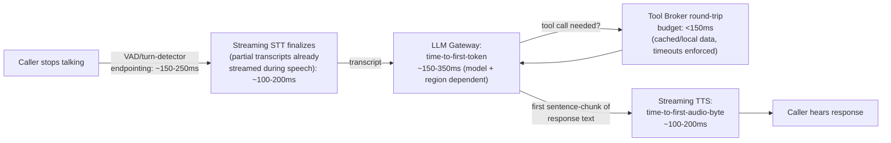

# 02 — Telephony/Voice Vendor Comparison & Voice Pipeline

## 1. Vendor comparison (researched July 2026)

Six options evaluated for the voice-AI layer: **Twilio** (Media Streams / ConversationRelay), **Retell AI**, **Vapi**, **OpenAI Realtime API**, **Daily (Pipecat/Pipecat Cloud)**, **LiveKit (Agents)**. Sources are pricing pages, vendor docs, independent benchmark suites (notably Cekura's fixed-stack benchmark and a Telnyx-run comparison), and public status pages — cited inline. Where sources conflict (latency numbers vary a lot across methodologies), both are shown rather than silently picking one.

|                                      | Twilio (ConvRelay/Media Streams)                                                                 | Retell AI                                                   | Vapi                                                   | OpenAI Realtime API                                                                        | Daily / Pipecat Cloud                                                                                                     | **LiveKit (Agents)**                                                                                                 |
| ------------------------------------ | ------------------------------------------------------------------------------------------------ | ----------------------------------------------------------- | ------------------------------------------------------ | ------------------------------------------------------------------------------------------ | ------------------------------------------------------------------------------------------------------------------------- | -------------------------------------------------------------------------------------------------------------------- |
| **Pricing (all-in, approx.)**        | $0.07/min (ConvRelay) or ~$0.02–0.06/min BYO on Media Streams; +$0.0085–0.022/min base voice leg | $0.07/min base, realistic all-in **$0.13–0.31/min**         | $0.05/min base, realistic all-in **$0.13–0.33/min**    | Token-based: **$0.05–0.10/min cached, $0.18–0.46/min uncached** (model only, no telephony) | $0.01–0.03/min compute + $0.018/min PSTN + $0.20/transfer event; volume discounts to $0.0015/min; free if self-hosted OSS | Free (Build tier/self-host) to $0.01/min agent-session + $0.003–0.004/min SIP; near-zero platform margin self-hosted |
| **Latency (independently reported)** | ~491ms–1000ms p50 (disputed); carrier hop ~89ms p50                                              | 680ms–1.96s median depending on methodology                 | 720ms–2.34s median, tunable to ~465ms                  | ~190–500ms model-only best case; 1.1–2.24s p50 in real deployments                         | 3.15s p50 untuned; ~1s achievable hand-tuned                                                                              | 2.46s p50 untuned; ~1.3–1.4s achievable hand-tuned                                                                   |
| **Interruption/barge-in**            | Native, configurable sensitivity                                                                 | Strong proprietary turn model, 4.79/5                       | Configurable VAD/transcription, 4.63/5 (lowest of six) | Native to speech-to-speech design                                                          | Excellent, SmartTurn+Silero VAD, 4.90/5 (highest)                                                                         | Excellent, adaptive ML turn detector, 4.89/5, 39% fewer false interrupts                                             |
| **SIP/PSTN transfer**                | Best-in-class, mature carrier-grade SIP REFER + warm transfer                                    | Full cold+warm, some config gotchas                         | Full cold+warm, needs SIP REFER on trunk               | No native feature — must build; native SIP connector still effectively beta                | Native, keeps original leg anchored                                                                                       | Full cold+warm **with prebuilt `WarmTransferTask` helper** — best packaged of the six                                |
| **Managed vs. building block**       | Spectrum                                                                                         | Fully managed, most opinionated                             | Managed orchestration, modular underneath              | Pure building block (model only)                                                           | Framework=building block, Cloud=managed infra                                                                             | Building block (transport + agent runtime, BYO STT/LLM/TTS)                                                          |
| **Reliability**                      | Very mature carrier, frequent minor regional incidents typical of scale                          | Claims 99.99%; 48+ tracked incidents/yr; best Pass³ (96.6%) | Claims 99.9%; documented mass call-drop incident       | 99.93% API uptime but 4 disruptions in 4 days (late July 2026)                             | Limited independent scrutiny, clean recent history                                                                        | Powers OpenAI Voice Mode/Character.AI at scale; 97.22% recent 30-day uptime (below own SLA), lowest Pass³ (84.7%)    |
| **Vendor lock-in**                   | Low-medium                                                                                       | High (proprietary ASR/turn engine is the product)           | Medium                                                 | Very high at AI-model layer                                                                | Low (OSS) but Cloud transfer features Daily-specific                                                                      | **Lowest** — Apache 2.0, fully self-hostable, BYO AI providers                                                       |
| **Node.js/TypeScript DX**            | Mature, many worked tutorials                                                                    | Official typed TS SDK                                       | Official typed TS SDK, React client SDK                | Good TS SDK, but you build everything else                                                 | **Python-only server framework**                                                                                          | **Genuine first-class Node.js Agents SDK** (`agents-js`), true port of the framework                                 |

_(Full per-vendor writeups with source URLs are preserved in the research archive; ping the platform team if the raw citations are needed for a vendor negotiation.)_

## 2. Recommendation

**LiveKit Agents (Node.js SDK) on LiveKit Cloud initially, with a documented path to self-hosting, fronted by Twilio or Telnyx as a pure SIP/PSTN carrier for call origination/termination.**

### Why this over the alternatives

- **Vs. Retell/Vapi (fully-managed voice-agent platforms):** both are faster to a demo, but both lock the platform into a proprietary turn-taking engine (Retell) or a proprietary orchestration/config format (Vapi) that isn't portable if Ethixweb ever needs to renegotiate pricing at scale, self-host for cost or compliance reasons, or swap components. Given this platform's explicit goal of becoming a long-lived, owned product (not a wrapper around someone else's roadmap — the entire premise of leaving Housecall Pro's built-in AI), that lock-in is a bad trade for a platform meant to run for years across thousands of tenants.
- **Vs. OpenAI Realtime API directly:** it's the most expensive per-minute option uncached, has no telephony or transfer story of its own (100% DIY), and — concretely, as of the research date — had four service disruptions in four days in late July 2026. A dead OpenAI API mid-call means a caller on a silent line with no fallback path, since the speech-to-speech format has no drop-in equivalent from another vendor. Using OpenAI (or Anthropic, or any other model) as the **text LLM behind a separate STT/TTS pipeline** is still viable and kept swappable via the LLM Gateway (see [01](01-architecture-overview.md) §2) — the rejection here is specifically the bundled speech-to-speech product as the whole voice layer, not the model family.
- **Vs. Daily/Pipecat:** Pipecat's server framework is Python-only. Standardizing the backend on Node.js/TypeScript (see [14-backend-stack-and-code-standards.md](14-backend-stack-and-code-standards.md)) while running the single most latency-critical, most complex service in the entire platform in a different language and runtime is an unforced maintenance and hiring cost with no offsetting benefit — LiveKit's `agents-js` gives the same architectural pattern (composable STT/LLM/TTS pipeline, WebRTC transport, SIP integration) as a genuine first-class Node port, not a thin wrapper.
- **Vs. Twilio ConversationRelay as the whole stack:** Twilio remains excellent and is _retained_ in this architecture — but as the SIP/PSTN carrier leg only, not the agent brain. ConversationRelay's turn-management protocol is proprietary to Twilio; using Twilio purely as a carrier (a mature, portable, standards-based role it's excellent at) while running the actual conversational agent on LiveKit keeps the option to switch carriers (to Telnyx, which benchmarked a faster raw SIP hop) later without touching a single line of agent logic.

### Honest trade-offs to plan for

- LiveKit's neutral, untuned benchmark latency (2.46s p50) is **not** sub-1-second out of the box. Hitting the sub-1-second target (§3) requires deliberate engineering: streaming STT/TTS selection, VAD/turn-detector threshold tuning, and co-locating compute in the same AWS region as the LiveKit Cloud edge nearest the caller. This is real Phase 1 engineering work, not a config toggle — tracked explicitly in [13-implementation-backlog.md](13-implementation-backlog.md).
- LiveKit Cloud's own recent 30-day uptime (97.22%) trailed its 99.9% SLA target and Retell/Vapi's benchmark reliability scores. The reliability architecture in [08-security-observability-reliability.md](08-security-observability-reliability.md) (circuit breakers, voice reconnect, graceful degradation, synthetic canary calls) is written assuming the voice vendor **will** have incidents, not as a hedge against a hypothetical.
- Self-hosting LiveKit's SFU is the cost-control lever for the "thousands of calls/day" future state (see [09-cost-analysis.md](09-cost-analysis.md)) but is explicitly deferred past Phase 1 — LiveKit Cloud is used at launch to avoid taking on SFU operations before the product itself is validated.

## 3. Voice pipeline & latency budget

**Budget to hit <1000ms perceived latency (caller stops talking → caller hears first response audio):**

| Stage                                                            | Budget          | How it's hit                                                                                                                                                                                                                                                                                                                              |
| ---------------------------------------------------------------- | --------------- | ----------------------------------------------------------------------------------------------------------------------------------------------------------------------------------------------------------------------------------------------------------------------------------------------------------------------------------------- |
| Endpointing (turn detection)                                     | 150–250ms       | LiveKit's adaptive ML turn detector, tuned per-business for typical speech cadence (avoids both cutting callers off and waiting too long after they finish)                                                                                                                                                                               |
| STT finalization                                                 | 100–200ms       | Streaming STT (Deepgram or equivalent) with partial transcripts consumed continuously during speech, so only the _final_ segment needs to finalize after endpointing — not the whole utterance                                                                                                                                            |
| LLM time-to-first-token                                          | 150–350ms       | Fast, low-reasoning-effort model tier for turn-taking responses (see model routing in [14](14-backend-stack-and-code-standards.md)); prompt caching on the large static system-prompt portion (platform base + tenant/business config, see [03](03-conversation-engine.md) §1) so only the small dynamic tail is processed fresh per turn |
| Tool broker round-trip (when a tool call is needed mid-response) | <150ms          | Enforced per-tool timeout (see [04](04-ai-tool-architecture.md)); reads favor Redis-cached data over live CRM calls on the hot path                                                                                                                                                                                                       |
| TTS time-to-first-byte                                           | 100–200ms       | Streaming, sentence-chunked TTS — synthesis begins on the first complete clause of the LLM's streamed output, not after the full response is generated                                                                                                                                                                                    |
| **Total (no tool call needed)**                                  | **~500–1000ms** |                                                                                                                                                                                                                                                                                                                                           |
| **Total (with one tool call)**                                   | **~650–1150ms** | Slightly over budget on tool-heavy turns (e.g. `searchCustomer` at call start) is acceptable — a single "let me pull that up" filler phrase, itself streamed instantly, masks it naturally rather than dead air                                                                                                                           |

**Regional co-location**: application compute (LLM Gateway, Tool Broker) is deployed in the AWS region nearest the LiveKit Cloud edge serving that call's geography, to avoid adding cross-region network hops to every turn — this is a deployment-topology decision (see [10-deployment-cicd.md](10-deployment-cicd.md)), not a code change, and is revisited as the tenant base becomes geographically distributed.

**Filler-phrase strategy**: for any turn where a tool call is expected to take longer than ~400ms (e.g. `createCustomer` against a live CRM), the LLM is prompted to emit a brief natural acknowledgment ("Let me get that set up...") before the tool result returns, which streams to TTS immediately — this converts unavoidable backend latency into natural conversational pacing instead of silence, directly addressing the "long dead air" failure mode this platform replaces.

## 4. Carrier layer detail

- **Inbound**: business's published phone number is a Twilio (or Telnyx) number, SIP-trunked into LiveKit via LiveKit's SIP integration — LiveKit receives the call as a room participant.
- **Outbound transfer** (to a live human/on-call technician): executed via LiveKit's `WarmTransferTask` (caller placed on hold, technician dialed into a private consultation room, briefed, then connected) or a cold SIP REFER for lower-severity handoffs — decision made by the `escalateEmergency` tool's returned action (see [04](04-ai-tool-architecture.md) §3.8 and [07](07-notification-and-emergency.md) §5.3).
- **Recording**: call audio recorded via LiveKit's egress feature, stored to S3 (see [06-database-schema.md](06-database-schema.md) `calls.recording_url`), encrypted at rest (see [08](08-security-observability-reliability.md) §1.4).
