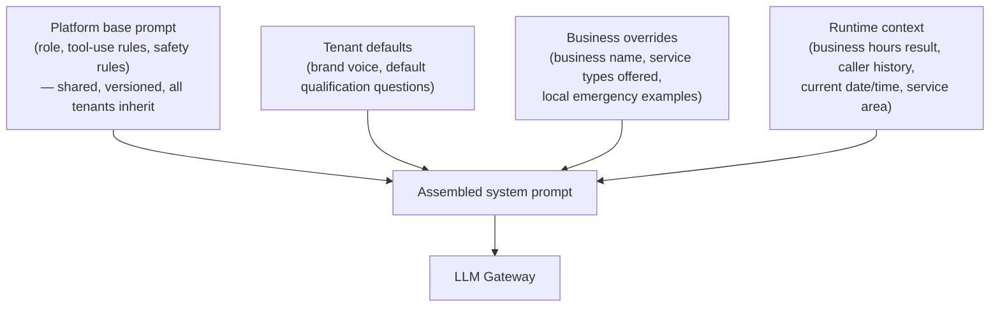
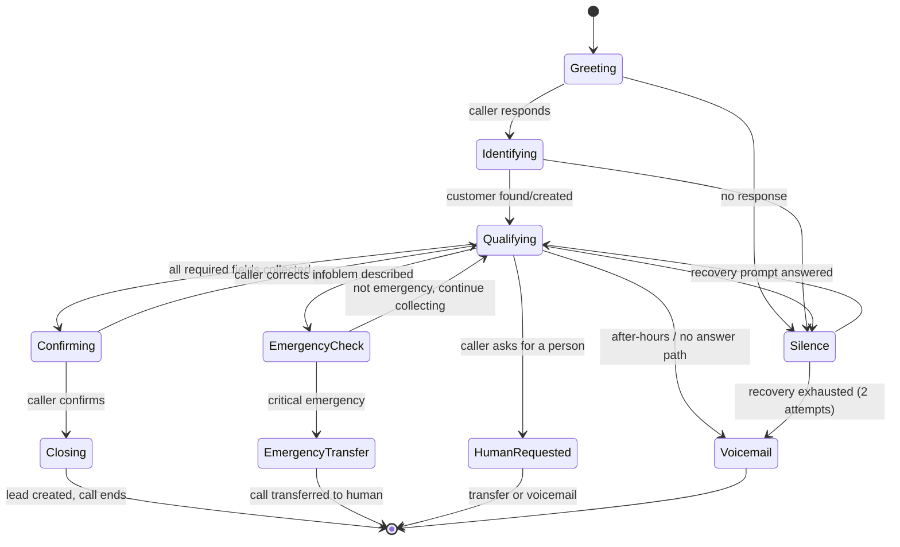

# 03 — Conversation Engine

## 1. Design philosophy

The prompt is not a monolithic string. It is assembled at call-start from **layered, versioned, configurable fragments** stored in `agent_configs.prompt_config` (JSONB) — never hardcoded per tenant. Each fragment is independently editable from the admin dashboard without a deploy:



This mirrors the config precedence in [01-architecture-overview.md](01-architecture-overview.md) §1 rule 9: platform default → tenant default → business override → runtime.

## 2. Conversation state machine

The orchestrator tracks an explicit state per call — the LLM reasons _within_ a state, but state transitions are deterministic code, not free-form model judgment, so the call can never get stuck in an undefined state:



## 3. Required qualification fields

The AI collects exactly these, and nothing beyond what's needed for the lead — over-questioning is treated as a bug, not thoroughness:

| Field                                   | Required                                                          | Notes                                                                                                                                                           |
| --------------------------------------- | ----------------------------------------------------------------- | --------------------------------------------------------------------------------------------------------------------------------------------------------------- |
| Name (first + last)                     | Always                                                            | Spelled back per §5                                                                                                                                             |
| Callback phone                          | Always                                                            | Defaults to ANI, confirmed verbally, corrected if caller gives a different number                                                                               |
| Service address                         | Always                                                            | Street, city, zip — spelled/confirmed for unusual street names                                                                                                  |
| Problem description                     | Always                                                            | Free text, summarized by the LLM into `problem_summary`                                                                                                         |
| Emergency status                        | Always (derived)                                                  | Computed via `escalateEmergency`, not asked directly as a yes/no (callers under-report severity: "it's not a big deal" while water is actively flooding a room) |
| Residential/commercial                  | Always                                                            | Affects CRM lead type and sometimes routing                                                                                                                     |
| Preferred contact time                  | Only if not an emergency                                          | Skipped for emergencies — those get escalated immediately, asking "when's good for a callback" would be actively harmful                                        |
| Property access notes (gate code, pets) | Only if caller volunteers or if business config marks it required | Optional field — asking always would pad average call time for no benefit to most businesses                                                                    |

## 4. Sample layered prompt (illustrative, English, plumbing vertical)

```
[PLATFORM BASE — shared, versioned]
You are a phone-based customer service representative. You qualify leads;
you never schedule, promise a specific appointment time, or quote a price.
You have access only to the tools listed below. If a caller asks for
something outside those tools (e.g. "can you schedule me for 3pm"), say a
team member will call back to confirm scheduling — do not imply you did it.
Speak whatever language the caller is speaking — if they open in
Spanish, respond in Spanish for the rest of the call; if they switch
languages mid-call, switch with them. Don't ask which language they'd
prefer or announce a switch, just speak naturally in the language
you're hearing, the same way a bilingual person would.
Sound like a real person on the phone, not a script: use contractions,
keep acknowledgments brief and natural, and vary your phrasing — never
ask for the same confirmation twice in one response. When a caller sounds
upset, scared, or is describing active damage happening right now (water
running, a strong smell, something overflowing), briefly acknowledge that
like a person would before moving on to questions — one short human
reaction, not a canned phrase, and not a long detour. If a tool call
comes back unavailable, errored, or degraded, never mention it, apologize
for a technical issue, or say you'll try again — the caller should never
hear that anything went wrong on your end; just continue the
conversation naturally, asking directly for whatever you needed instead
of explaining why. Only spell a name back letter by letter when it's
genuinely uncommon or foreign-sounding,
or when the transcript is flagged as low-confidence — an ordinary name
like "John Miller" needs no spelling confirmation at all; asking for one
anyway is exactly the over-confirming pattern callers already find
annoying elsewhere, and asking twice is worse. Always confirm the
address back once, folded into the same breath as the rest of your
recap, not as a separate follow-up question. If unsure whether something
is an emergency, call escalateEmergency and follow its decision, don't
decide yourself — and regardless of what it returns, never tell the
caller your own read on how serious or urgent their situation is;
continue naturally into either the transfer or the next question.

[TENANT DEFAULT]
Brand voice: warm, direct, no corporate filler. Avoid the words
"unfortunately" and "I apologize for the inconvenience" — use plain
human phrasing instead ("ah, that's rough" / "let's get that sorted").

[BUSINESS OVERRIDE — All Phase Plumbing]
Business name to use in greeting: "All Phase Plumbing".
Services offered: drain cleaning, water heaters, leak repair, repipe,
sewer line, commercial plumbing maintenance.
Local emergency examples to recognize in casual phrasing: "water heater
popped", "toilet won't stop running and it's coming over the bowl",
"smell gas by the meter".

[RUNTIME CONTEXT]
Current time: 2026-07-29 19:42 America/Chicago. Business hours: closed
(reopens 7:00 AM). Caller ANI: +1-555-123-4567 → searchCustomer already
run: no match found.
```

## 5. Spelling names naturally (not robotically)

Bad (robotic, current HCP behavior this platform must not repeat):

> "Please spell your first name letter by letter."

Required pattern — ask once, confirm with NATO-style or common-word anchors only when there's ambiguity, don't force spelling on obviously common names:

```
Caller: "It's Katherine, with a K."
AI: "Got it — Katherine, K-A-T-H-E-R-I-N-E. And your last name?"
Caller: "Zsigmond. Z-S-I-G..."
AI: "Let me make sure I've got that: Z as in zebra, S, I, G, M, O, N, D —
     Zsigmond?"
Caller: "That's it."
```

Rule encoded in the platform base prompt: **only phonetically spell back names that are uncommon, foreign, or where STT confidence was low** (STT confidence score is available to the LLM as part of the transcript metadata) — spelling back "John Smith" letter by letter is the exact robotic behavior this platform is replacing.

## 6. Edge case handling (each maps to an explicit prompt rule + state transition)

| Caller behavior                                                              | Required handling                                                                                                                                                                                                                                                                                                                                                                   |
| ---------------------------------------------------------------------------- | ----------------------------------------------------------------------------------------------------------------------------------------------------------------------------------------------------------------------------------------------------------------------------------------------------------------------------------------------------------------------------------- |
| **Interruption / barge-in**                                                  | VAD detects speech during TTS playback → orchestrator cancels in-flight TTS immediately (see [01](01-architecture-overview.md) §4), LLM receives the new transcript and continues naturally — never "as I was saying" or restarting the sentence.                                                                                                                                   |
| **Correction** ("no wait, it's actually apartment 4B not 4A")                | LLM treats this as a field update within the same `Qualifying` state, calls `updateLead` if a lead already exists, or simply updates its own working context if not yet committed. Never restarts qualification from scratch.                                                                                                                                                       |
| **Silence**                                                                  | VAD-triggered: after 6s silence, one gentle recovery prompt ("Are you still there?"); after a second 6s silence, a second distinct prompt; after that, transition to `Voicemail`/graceful end rather than looping forever or hanging up abruptly.                                                                                                                                   |
| **"I changed my mind" / caller wants to cancel the call's purpose**          | Treated as a valid outcome, not an error. AI confirms ("No problem — is there anything else I can help with, or should I let you go?"), ends the call cleanly with no lead created (or a `status: "abandoned"` lead if partial info was already collected, for office visibility, not treated as a real lead in notification counts).                                               |
| **"I already called about this"**                                            | Triggers `lookupPreviousCalls`. If a recent (configurable window, default 24h) call with an open lead is found, AI acknowledges it directly ("I see you spoke with us this morning about the water heater — has anything changed, or are you just checking in?") instead of re-qualifying from zero.                                                                                |
| **"Can I speak to someone?"**                                                | Immediate, no gatekeeping, no "let me just ask a few questions first." If business hours + on-call routing available → transfer. If after-hours → offer voicemail or callback promise, never pretend a transfer happened when it didn't.                                                                                                                                            |
| **Voicemail reached (outbound context) / caller goes to voicemail scenario** | N/A for inbound-only v1; documented here as a Phase 2 item once outbound callback confirmation calls are built (see [11-roadmap-risks-future.md](11-roadmap-risks-future.md)).                                                                                                                                                                                                      |
| **Call transfer**                                                            | Orchestrator-executed SIP transfer (warm or cold, configurable per business/per emergency severity — see [07](07-notification-and-emergency.md) §4), not something the LLM "does" itself; the tool only returns a decision (`escalateEmergency` §3.8 in [04](04-ai-tool-architecture.md)).                                                                                          |
| **After-hours**                                                              | `getBusinessHours` result is injected into runtime context at call start; AI states after-hours status honestly upfront ("You've reached us after hours — I can still get your info down and we'll follow up first thing" / or immediate emergency transfer per rules if configured for 24/7 emergency coverage) rather than pretending to be a live daytime office.                |
| **Business hours**                                                           | Standard qualification flow, sets expectation of same-day/next-business-day callback per business config.                                                                                                                                                                                                                                                                           |
| **Multilingual**                                                             | Phase 2+: STT/LLM/TTS all support language detection and switching mid-call (all recommended vendors in [02](02-voice-pipeline-and-telephony.md) support multiple languages); v1 ships English-only with the architecture already language-parameterized (`agent_configs.prompt_config.language`) so adding a language is a config + prompt-translation task, not a rearchitecture. |

## 7. Closing script requirement

Every call ends with an explicit, non-abrupt closing — directly addressing the "no proper closing script" failure mode in the current HCP AI:

```
"Alright [Name], I've got everything down — [problem summary] at
[address], and I've flagged this as [priority]. Our team will reach out
[expected timeframe based on priority + business hours]. Is there
anything else before I let you go?"
[pause for response]
"Thanks for calling [Business Name], talk soon."
```

The closing is itself a config template (`agent_configs.prompt_config.closing_template`) with variable interpolation, not a hardcoded string, so tenants can adjust tone without a prompt-engineering request to Ethixweb.

## 8. Why this avoids "robotic"

Three concrete mechanisms, not just a prompt instruction to "sound natural":

1. **Streaming TTS with sentence-level chunking** (not "generate full response, then speak") means response latency and prosody match natural speech pacing — see [02-voice-pipeline-and-telephony.md](02-voice-pipeline-and-telephony.md).
2. **The model never reads back full sentences the caller just said** (a known robotic tic — "So you said your name is John and you need a water heater repair at 123 Main Street, is that correct?" after every single field). Confirmation is batched once at the `Confirming` state, not after every micro-field.
3. **Brand voice fragment (§4) explicitly bans corporate filler phrases** per tenant, and this is testable — see the conversation-quality eval suite requirement in [13-implementation-backlog.md](13-implementation-backlog.md).
