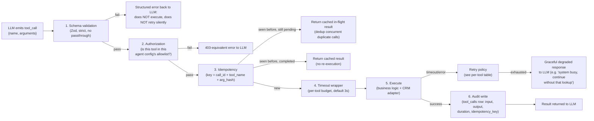

# 04 — AI Tool-Calling Architecture

## 1. Core rule

**The LLM's capability surface is exactly this document.** There is no "generic API call" tool, no SQL tool, no filesystem tool, no scheduling/dispatch tool. If a capability isn't specified below with its own schema and authorization rule, the model cannot reach it — not because a prompt tells it not to, but because the tool broker's registry doesn't contain it. Prompt instructions are a UX layer; the tool registry is the actual security boundary.

## 2. Tool broker pipeline (every call passes through all six stages)

## 3. Tool registry

Each tool below is versioned (`v1`), and its schema is enforced with Zod (or equivalent JSON Schema) at the broker layer — the LLM only ever sees validated, typed arguments; malformed arguments never reach business logic.

**`business_id` and `call_id` never appear in any tool's Input below, and are not part of any tool's model-facing schema.** They're facts about the call the model has no way to know and no reason to reason about — the broker (`ExecuteToolUseCase`) passes the real, trusted values from the call's own routing context directly into the tool handler alongside the model's arguments, the same way `updateLead` already scopes itself to `call_id` without the model ever supplying one. Found live: an earlier version of this registry declared both as required model-fillable parameters, and a real transcript showed the model doing exactly what an unfillable required parameter forces it to do — asking the caller "which business am I helping you with today?" instead of just proceeding.

### 3.1 `searchCustomer`

|                   |                                                                                                                                                                   |
| ----------------- | ----------------------------------------------------------------------------------------------------------------------------------------------------------------- |
| **Purpose**       | Look up an existing customer by phone before ever creating one. First tool called on every inbound call.                                                          |
| **Input**         | `{ phone: string (E.164) }`                                                                                                                                       |
| **Output**        | `{ found: boolean, customer?: { id, name, address, tags, lastServiceDate, openLeads } }`                                                                          |
| **Authorization** | Available to all agent configs by default.                                                                                                                        |
| **Idempotency**   | Read-only; not applicable, but result is cached 60s per phone+business to avoid duplicate CRM reads if the model calls it twice in one conversation.              |
| **Timeout**       | 2s against CRM adapter; on timeout, falls back to local `customers` table cache (may be stale but non-blocking) and flags `stale: true` in output.                |
| **Retries**       | 2 retries with 250ms/750ms backoff on transient CRM errors before falling back to local cache.                                                                    |
| **Errors**        | CRM auth failure → does not retry (permanent), surfaces `{found: false, degraded: true}` so the AI proceeds as a new-customer flow rather than stalling the call. |

### 3.2 `createCustomer`

|                   |                                                                                                                                                                                                                                                                                                                 |
| ----------------- | --------------------------------------------------------------------------------------------------------------------------------------------------------------------------------------------------------------------------------------------------------------------------------------------------------------- |
| **Purpose**       | Create a new CRM customer record — only called after `searchCustomer` returns `found: false`.                                                                                                                                                                                                                   |
| **Input**         | `{ name: {first, last}, phone: E.164, email?: string, address: {street, city, state, zip}, source: "ai_csr" }`                                                                                                                                                                                                  |
| **Output**        | `{ customer_id: string, created: boolean }` — `created: false` if a race-condition dedup at the DB unique-constraint layer discovered a concurrently-created match, in which case the existing `customer_id` is returned instead (see [05-crm-integration.md](05-crm-integration.md) §4 for the race handling). |
| **Authorization** | All agent configs.                                                                                                                                                                                                                                                                                              |
| **Idempotency**   | Key = `call_id + "createCustomer"`. If the LLM calls this twice in one call (e.g. after a retry-worthy confusion), the second call returns the first result without hitting the CRM again.                                                                                                                      |
| **Timeout**       | 3s.                                                                                                                                                                                                                                                                                                             |
| **Retries**       | 3 retries, exponential backoff, only on network/5xx — never retries on 4xx validation errors (those are surfaced to the LLM to ask the caller for corrected info, e.g. invalid phone format).                                                                                                                   |
| **PII handling**  | Address/phone/email logged in `tool_calls.input` but redacted in any log line shipped to third-party observability tools (see [08](08-security-observability-reliability.md) §4).                                                                                                                               |

### 3.3 `createLead`

|                   |                                                                                                                                                                                                                                                                                                                                                                  |
| ----------------- | ---------------------------------------------------------------------------------------------------------------------------------------------------------------------------------------------------------------------------------------------------------------------------------------------------------------------------------------------------------------- |
| **Purpose**       | The single "commit" action of a qualifying call. Creates a lead/estimate-request in the CRM and enqueues the notification pipeline. **This tool never creates a scheduled job or calendar appointment** — that field/endpoint is not reachable from this tool's implementation, by design (see [05](05-crm-integration.md) §3 on how HCP models leads vs. jobs). |
| **Input**         | `{ customer_id, problem_summary: string, priority: "emergency"                                                                                                                                                                                                                                                                                                   | "urgent" | "routine" | "estimate", lead_type: "residential" | "commercial", preferred_contact_method?, transcript_ref }` |
| **Output**        | `{ lead_id, status: "created" }`                                                                                                                                                                                                                                                                                                                                 |
| **Authorization** | All agent configs. This is the only tool that triggers the notification pipeline — it cannot be called more than once successfully per `call_id` (enforced by a unique constraint on `leads.call_id`).                                                                                                                                                           |
| **Idempotency**   | Key = `call_id` (one lead per call, hard constraint, not just a soft key).                                                                                                                                                                                                                                                                                       |
| **Timeout**       | 3s for the CRM write; the notification enqueue itself is fire-and-forget via the outbox (§5 of doc 01) so it cannot add latency to the call's closing script even if the queue is momentarily backed up.                                                                                                                                                         |
| **Retries**       | 4 retries on the CRM write; if all exhausted, the lead is still recorded locally (`leads` table) with `status: "pending_crm_sync"` and a background job keeps retrying — **the caller-facing conversation never blocks or fails because the CRM was down**; office notification still fires off the local record.                                                |

### 3.4 `updateLead`

|                       |                                                                                                  |
| --------------------- | ------------------------------------------------------------------------------------------------ |
| **Purpose**           | Amend a lead created earlier in the same call (e.g. caller corrects the address after the fact). |
| **Input**             | `{ lead_id, patch: Partial<{problem_summary, priority, lead_type}> }`                            |
| **Output**            | `{ lead_id, updated: true }`                                                                     |
| **Authorization**     | Only callable within the same `call_id` that created the lead.                                   |
| **Idempotency**       | Key = `lead_id + patch_hash`; identical repeated patches are no-ops.                             |
| **Timeout / retries** | Same policy as `createLead`.                                                                     |

### 3.5 `sendNotification`

|             |                                                                                                                                                                                                                                                                                                                                                                                                                                                                                                                              |
| ----------- | ---------------------------------------------------------------------------------------------------------------------------------------------------------------------------------------------------------------------------------------------------------------------------------------------------------------------------------------------------------------------------------------------------------------------------------------------------------------------------------------------------------------------------- |
| **Purpose** | Explicitly not exposed to the LLM as a free-form tool. Notification dispatch is a deterministic side effect of `createLead`/emergency escalation, not something the model decides to invoke arbitrarily — this prevents the AI from being social-engineered into spamming notifications or sending arbitrary text to arbitrary numbers. Documented here because it's the internal service the broker calls after `createLead` succeeds; full design in [07-notification-and-emergency.md](07-notification-and-emergency.md). |

### 3.6 `getBusinessHours`

|                     |                                                                                                                                                                                 |
| ------------------- | ------------------------------------------------------------------------------------------------------------------------------------------------------------------------------- |
| **Purpose**         | Determine if the business is currently open, so the AI can set caller expectations accurately ("someone will call you back within the hour" vs "first thing tomorrow morning"). |
| **Input**           | `{ at?: timestamp (defaults to now) }`                                                                                                                                          |
| **Output**          | `{ isOpen: boolean, opensAt?: timestamp, isHoliday: boolean }`                                                                                                                  |
| **Authorization**   | All agent configs. Read-only, cached 5 minutes.                                                                                                                                 |
| **Timeout/Retries** | 1s timeout, falls back to a conservative "treat as after-hours" default on failure (never falsely tells a caller the office is open).                                           |

### 3.7 `getServiceAreas`

|                   |                                                                                                                                                                                   |
| ----------------- | --------------------------------------------------------------------------------------------------------------------------------------------------------------------------------- |
| **Purpose**       | Check whether a caller's address/zip is within the business's service area, so the AI can set expectations or offer a referral instead of qualifying a lead that can't be served. |
| **Input**         | `{ zip: string }`                                                                                                                                                                 |
| **Output**        | `{ inServiceArea: boolean, nearestServiceableArea?: string }`                                                                                                                     |
| **Authorization** | All agent configs. Read-only, cached 1 hour (service areas change rarely).                                                                                                        |

### 3.8 `escalateEmergency`

|                     |                                                                                                                                                                                                                                                                                                                                                   |
| ------------------- | ------------------------------------------------------------------------------------------------------------------------------------------------------------------------------------------------------------------------------------------------------------------------------------------------------------------------------------------------- |
| **Purpose**         | Evaluate a described problem against the business's configurable emergency rule set and trigger the correct escalation action (immediate call-forward, priority notification, etc.) — see [07](07-notification-and-emergency.md) §4 for the rules engine.                                                                                         |
| **Input**           | `{ description: string, detectedKeywords?: string[] }`                                                                                                                                                                                                                                                                                            |
| **Output**          | `{ isEmergency: boolean, severity: "critical"                                                                                                                                                                                                                                                                                                     | "high" | "medium", action: "forward_call" | "priority_notify" | "standard_lead" }` |
| **Authorization**   | All agent configs.                                                                                                                                                                                                                                                                                                                                |
| **Timeout/Retries** | 1.5s timeout; on failure, **fails safe toward escalation** — if the rules engine can't be reached, default to treating ambiguous "leak/water/gas" language as at least `priority_notify` rather than silently downgrading to routine (a false emergency escalation costs a phone call; a missed one costs a flooded basement or a gas explosion). |
| **Side effect**     | If `action: "forward_call"`, the Conversation Orchestrator (not the LLM) executes the actual SIP transfer — the tool only returns a _decision_, transfer execution is orchestrator-level, another layer of "the model decides, infrastructure code acts."                                                                                         |

### 3.9 `lookupPreviousCalls`

|                     |                                                                                                                                  |
| ------------------- | -------------------------------------------------------------------------------------------------------------------------------- |
| **Purpose**         | Give the AI context on repeat callers ("I already called about this") without re-asking qualification questions from scratch.    |
| **Input**           | `{ customer_id, limit?: number (default 5) }`                                                                                    |
| **Output**          | `{ calls: [{ call_id, date, summary, leadStatus }] }`                                                                            |
| **Authorization**   | All agent configs. Read-only, 30s cache per customer.                                                                            |
| **Timeout/Retries** | 1.5s; on failure returns empty list — degraded but never blocking (AI proceeds as if no history, worst case re-asks a question). |

## 4. Cross-cutting rules that apply to every tool

- **Timeouts are enforced by the broker, not by the tool implementation** — a tool cannot accidentally block the conversation by omitting its own timeout handling; the wrapper cancels and returns a degraded response regardless.
- **Every tool call is logged to `tool_calls`** (see [06-database-schema.md](06-database-schema.md)) with full input/output — this is the audit trail for "why did the AI do X," independent of any LLM-provider-side logging.
- **No tool ever returns raw CRM credentials, internal IDs beyond what's needed, or another tenant's data** — output schemas are explicit allowlists (never `SELECT *`-style passthrough of a CRM's raw response).
- **Rate limiting** is applied per-tenant per-tool at the broker (token bucket in Redis) so one runaway conversation or one compromised/misbehaving tenant integration cannot exhaust shared CRM API rate limits for other tenants on the platform.
- **New CRM adapters or new business logic never require new tools** — `createLead`, for example, is CRM-agnostic; the CRM-specific mapping (how "lead" is represented in HCP vs. ServiceTitan) lives entirely inside the adapter behind `CRMAdapter.createLead()`, invisible to the tool broker and the LLM.
