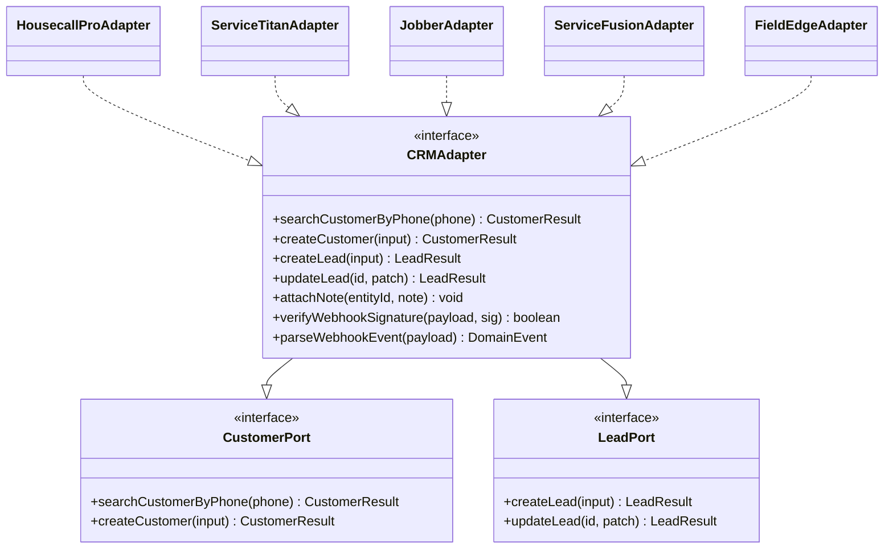
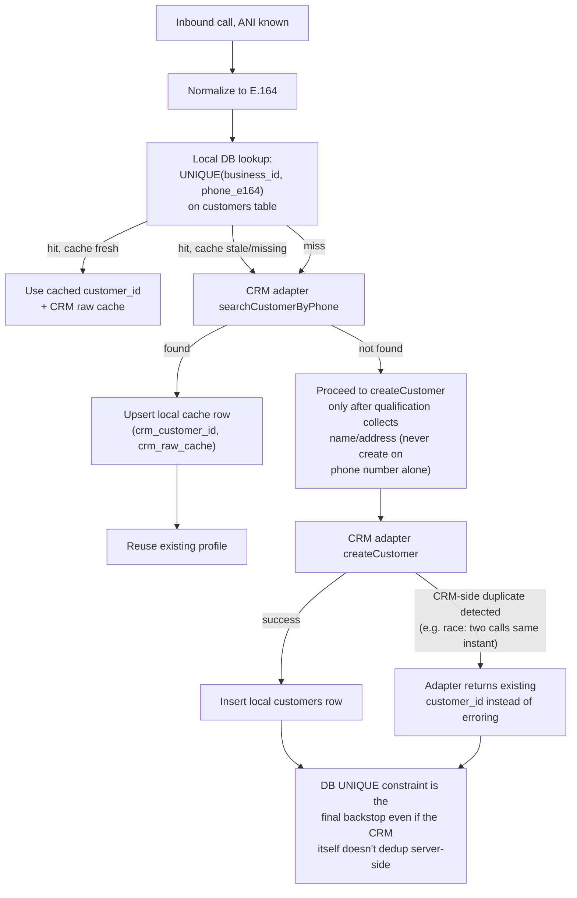

# 05 — CRM Integration Layer

## 1. Adapter pattern — the core abstraction

Per [14-backend-stack-and-code-standards.md](14-backend-stack-and-code-standards.md) §2-3: the tool broker and all business logic (qualification, dedup, escalation) depend only on this interface. No CRM-specific type, endpoint, or quirk is visible outside its adapter. Adding a CRM is additive (new adapter class + contract tests passing); it is never a reason to touch `QualifyLeadUseCase`, the tool broker, or any other adapter's code.

Every adapter method is wrapped by the circuit breaker + retry/timeout policy described in [01-architecture-overview.md](01-architecture-overview.md) §6 and [08-security-observability-reliability.md](08-security-observability-reliability.md) §3 — this is infrastructure the adapter interface provides uniformly, not something each adapter implementation reimplements.

## 2. Housecall Pro — capability research

Researched directly against `docs.housecallpro.com` (Stoplight-hosted; operation names/URLs confirmed via the rendered nav tree, but most per-operation parameter tables would not render for automated fetch) and `help.housecallpro.com` (fully server-rendered, read directly), July 2026. Every claim below is tagged **[Confirmed]** (official source, either the docs nav/URLs or a fully-read Help Center article), or **[Unverified]** (a third-party integration guide or reconstructed spec — sources sometimes disagree with each other, noted where they do). Treat **[Unverified]** items as hypotheses for the adapter's first design pass, not contracts — each has a corresponding line in the "must-verify-before-build" list at the end of this section.

### 2.1 Authentication

- **[Confirmed]** HCP supports both a static **API key** (the primary, documented path) and **OAuth2** (real, but its exact scope/audience is ambiguous — see below). API access requires the **MAX plan** (~$299–329/mo per third-party pricing breakdowns, unverified against HCP's own pricing page directly).
- **[Confirmed]** API keys are generated in-app (My Apps → API Key Management), **Admin-only**, with a choice of **Full access** or **Read-only**. There is no finer-grained, per-resource scoping — a key is account-wide (or, for a franchise/multi-location admin, cross-location) within its Full/Read-only tier. HCP's own docs describe a key as "a backdoor to all of the data in your account."
- **[Confirmed]** Deleting a key **immediately and silently breaks** any integration using it — no soft-deprecation window.
- **[Unverified, and a real open question]** A separate **"Partner Jobs API"** exists (own auth/webhooks pages, resources named "Partner Jobs"/"Partner Leads"/"Job Inbox V1"), which looks aimed at large pre-vetted lead-gen partners (Angi, Thumbtack-style) rather than a single Pro's own custom integration. **Whether a single-account AI CSR integration like this platform's should authenticate via the simple Admin API key or is expected to use OAuth2/the Partner Jobs API is not resolvable from public docs alone** — this needs a direct conversation with Housecall Pro (or empirical confirmation via a live sandbox account) before the adapter's auth module is finalized.
- Design implication: `HcpAdapter`'s credential layer holds one long-lived bearer key per connected business (with a `key_type: full | read_only` flag, since HCP itself exposes that distinction), with the auth mechanism kept swappable behind the `CRMAdapter` interface rather than hard-coded, in case the Partner path turns out to be required.

### 2.2 Customers

- **[Confirmed]** Distinct, resolvable endpoints exist: `GET /customers` (list), `POST /customers` (create), `GET /customers/{id}`, `PUT /customers/{id}`, plus address sub-resources (`GET`/`POST` addresses on a customer).
- **[Unverified]** Whether `GET /customers` supports a documented phone-number search/filter parameter could not be confirmed — parameter tables didn't render. A third-party reconstructed spec shows a generic `q` string param, but that spec is explicitly a best-effort, self-flagged-unreconciled reconstruction, not a verified mirror. **This is the single highest-priority must-verify item** for the `searchCustomer` tool ([04-ai-tool-architecture.md](04-ai-tool-architecture.md) §3.1) — confirm the real filter parameter against a live sandbox call before writing `HcpAdapter.searchCustomerByPhone()`. If server-side phone filtering isn't actually supported, the fallback is paging through `GET /customers` and matching client-side (viable at typical single-business customer-list sizes, worth revisiting if a franchise-scale account makes that too slow).
- **[Unverified]** Exact field names (`first_name`/`last_name`/`mobile_number`/`tags[]`/`addresses[]` etc.) are a reasonable starting hypothesis from a reconstructed schema, not a confirmed contract.
- **[Confirmed]** No dedicated "add customer note" API endpoint was found in the Customers operation list (unlike Jobs, which has one — §2.4) — if `Update Customer`'s body happens to accept a free-text notes field that's unconfirmed either way. Customer Notes are a real, documented **product** feature (internal-only, visible on the Customer Profile) but with no confirmed API surface.
- **[Confirmed]** No evidence of a custom-fields concept (arbitrary key/value metadata) on Customer or Job objects anywhere in the docs — don't design around one without direct confirmation.

### 2.3 Leads vs. Jobs — the answer to the critical design question

**[Confirmed, high confidence]** Housecall Pro has a **genuine, separate `Leads` resource** in its Public API, distinct from both `Jobs` and `Estimates`:

- `POST /leads` — Create Lead
- `GET /leads` — Get Leads (list)
- `GET /leads/{id}` — Get Lead
- `POST` **Convert Lead to Estimate or Job** — a distinct, deliberate action

The existence of a dedicated **Convert Lead to Estimate or Job** operation is strong, direct confirmation that creating a Lead does **not** implicitly schedule or dispatch anything — conversion is a separate, deliberate API call. This is corroborated two more ways: (1) a Help Center feature article, **"API Leads in Job Inbox,"** describes leads created via the API as landing in _"their own dedicated API Leads channel"_ inside the Job Inbox, sitting "ready to be scheduled or followed up on," with no automatic scheduling described; (2) the webhook catalog (§2.5) has a distinct **Lead** event family (`lead.created`, `lead.updated`, `lead.converted`, `lead.lost`, `lead.deleted`) separate from the **Job** family — `lead.converted` existing as its own event confirms conversion is a first-class, observable state transition, not a side effect of creation.

**This means `HousecallProAdapter.createLead()` maps directly onto `POST /leads` — the clean case, no unscheduled-job workaround needed.** The office's human scheduler is the one who later triggers "Convert Lead to Estimate or Job" (via HCP's own UI equivalent of that endpoint) — this platform's code never calls that conversion endpoint itself.

**Naming trap to avoid**: HCP also has an unrelated concept called **"Lead Sources"** (Settings → Lead Sources) — a marketing-attribution tag (e.g. "Google," "Yelp," "Thumbtack") stampable onto Customers/Jobs/Estimates. Do not conflate this `lead_source` attribution string with the `Lead` object itself when designing the adapter's data model.

**[Unverified]** The exact `Create Lead` request schema — specifically whether it requires a pre-existing `customer_id` (implying the adapter must resolve/create the Customer first, matching this platform's intended search → reuse-or-create → create-lead flow) or can create a customer inline, and what notes/description field it accepts — could not be confirmed and is the second must-verify item.

**Independent confirmation this design is the right one, not just a cautious guess**: Housecall Pro sells its **own competing "CSR AI" product**, and its own marketing states that product _"automatically schedule[s] jobs... jobs appearing directly on the calendar once booked"_ — i.e., HCP's first-party AI does exactly the auto-booking behavior this platform is built to avoid. This platform's search-reuse-customer → create-Lead → human-converts design is architecturally _more conservative_ than HCP's own product, using the same Lead/webhook surface HCP itself provides for exactly this discipline.

### 2.4 Jobs & Estimates (context — this platform's code should never call these directly)

**[Confirmed]** `Jobs` is a large, clearly scheduling-oriented resource: `Create a Job`, `Get Jobs`, `Get a Job`, `Update job schedule`, `Delete job schedule`, `Dispatch job to employees`, line-item and material management, `Add job tag`/`Remove job tag`, `Add job note`/`Delete job note`, attachments, job locking. A separate `Estimates` resource exists too. The presence of dedicated schedule/dispatch operations separate from job creation suggests a Job can plausibly be created unscheduled and scheduled as a second step, but exact required fields on `Create a Job` weren't confirmed — low priority to chase further, since this platform's adapter should never call `Create a Job` or `Dispatch job to employees` at all.

### 2.5 Notes, tags, attachments — for the call transcript

**[Confirmed]** Jobs have dedicated, working API endpoints: `Add job note` / `Delete job note`, `Add job tag` / `Remove job tag`, `Add an Attachment to a Job`.

**[Unverified]** Whether the **Lead** object has equivalent note/tag/attachment endpoints, or whether `Create Lead`'s body simply accepts a free-text field, is unconfirmed — the Leads operation list doesn't show a separate "add lead note" endpoint the way Jobs does.

**Recommendation, robust to either answer**: attach whatever qualification summary/transcript reference fits into `Create Lead`'s body if it accepts one (per the must-verify item in §2.3); regardless of that answer, once a Lead converts to a Job, use the confirmed `Add job note` endpoint to carry the full transcript reference/qualification summary onto the resulting Job — this path works no matter what Lead's own note capability turns out to be.

### 2.6 Webhooks

**[Confirmed]** Full documented event catalog includes, among others: **Customer** (`created`/`updated`/`deleted`), **Job** (`created`/`scheduled`/`completed`/`canceled`/appointment sub-events/etc.), **Estimate**, **Invoice**, and — most relevant here — **Lead** (`created`, `updated`, `converted`, `lost`, `deleted`). Setup is in-app (My Apps → Webhooks → enter receiving URL → receive a signing secret → choose event subscriptions), gated behind the MAX plan.

For this platform: subscribe to `lead.created` (reconcile/catch leads created through other channels on the same HCP account, e.g. Angi/Thumbtack partner integrations, so local `leads` state stays in sync) and `lead.converted` (close the loop — flip local `leads.status` to `converted_to_job`, per [06-database-schema.md](06-database-schema.md)).

**[Unverified, conflicting sources]** Signature verification is described as HMAC-SHA256 by two independent integration guides, but they **disagree on the exact header name** (`x-housecall-signature` vs `x-housecallpro-signature`). Do not hard-code either — register a test webhook against a logging endpoint and read the real header name empirically before writing `HcpAdapter.verifyWebhookSignature()`.

**[Unverified]** No official statement on retry count/backoff/delivery-order guarantees was found. **Build the webhook receiver as if delivery is at-least-once and possibly out-of-order regardless** — this is the same defensive posture [01-architecture-overview.md](01-architecture-overview.md) §7 already specifies platform-wide (dedup on provider event ID), so no HCP-specific special-casing is actually needed here, just don't assume better guarantees than that default.

### 2.7 Rate limits & pagination

**[Confirmed absence]** HCP does not publish rate-limit numbers — two independent sources state this explicitly, one of them HCP's own ecosystem documentation implying internal, undisclosed throttling ("reserves the right to throttle abusive clients"). **[Unverified, single uncorroborated source]** One guide claims "120 requests/minute" — no second source confirms this and it isn't safe to hard-code, but it's a reasonable planning ceiling to budget under until confirmed empirically (burst-test in a sandbox, watch for `429`/`Retry-After`).

**[Unverified]** Pagination style (offset/page vs. cursor) could not be confirmed from the primary source; a third-party reconstruction suggests offset-style (`page`/`page_size`). Confirm via an actual list-endpoint call before writing the adapter's pagination handling.

### 2.8 Duplicate customer prevention — direct validation of this platform's design

**[Confirmed]** Housecall Pro has **no API-level or creation-time duplicate-prevention** — `Create Customer` will simply create a second record if called again with the same phone number. What exists instead is a manual, staff-driven, **irreversible** "Manage and Merge Duplicate Customers" tool (Customers → Actions) that groups likely-duplicate profiles by name/phone/email match and requires a human to confirm a merge.

This directly validates the necessity of this platform's design (§4 below): HCP provides no safety net against duplicate creation, so `searchCustomer` running before any `createCustomer` call is not a nice-to-have, it's the only thing standing between this platform and the exact duplicate-customer failure mode it's replacing.

### 2.9 Must-verify-before-build list

These require a live HCP sandbox account (or a direct conversation with Housecall Pro) and cannot be resolved from public documentation — tracked as the first task under the `crm-integration` module in [13-implementation-backlog.md](13-implementation-backlog.md):

1. Whether this integration should authenticate via the simple Admin API key or requires OAuth2/the Partner Jobs API path (§2.1).
2. The real customer phone-search filter parameter on `GET /customers` (§2.2).
3. `Create Lead`'s exact request schema — required `customer_id`, inline-customer-creation support, notes/description field (§2.3).
4. Whether Lead has its own note/tag/attachment endpoints (§2.5).
5. The real webhook signature header name (§2.6).
6. Real rate-limit behavior, empirically (§2.7).
7. Real pagination contract on list endpoints (§2.7).

## 3. The critical design question: how does "the AI never schedules a job" map onto HCP's actual object model?

Resolved directly by §2.3: HCP's Public API exposes a genuine `Leads` resource, separate from `Jobs`/`Estimates`, with its own `Convert Lead to Estimate or Job` action and its own webhook event family. `HousecallProAdapter.createLead()` maps onto `POST /leads` — there is no need for the unscheduled-job workaround this section originally had to plan for as a fallback.

The contract this adapter method must satisfy — verified by the contract test suite ([10-deployment-cicd.md](10-deployment-cicd.md) §2), not merely assumed — is: **`createLead()` must never result in a technician being dispatched or a calendar slot being reserved.** Concretely, this means `HcpAdapter` contains no code path that calls `Create a Job`, `Update job schedule`, or `Dispatch job to employees` (§2.4) under any circumstance — those endpoints are as absent from the adapter's implementation as scheduling tools are from the AI's tool registry ([04-ai-tool-architecture.md](04-ai-tool-architecture.md) §1). The same "capability doesn't exist" principle applied to the LLM's tool surface is applied here one layer down, to the adapter's own code.

## 4. Customer search & dedup logic

- **Why search by phone specifically, not name**: phone number (ANI) is the one piece of caller-identifying information available before the conversation has produced anything else, and it's what the current HCP AI's duplicate-customer bug get wrong — this platform's `searchCustomer` tool ([04-ai-tool-architecture.md](04-ai-tool-architecture.md) §3.1) is the very first tool call on every inbound call, before any qualification question is asked.
- **Race condition handling**: two near-simultaneous calls from the same number (e.g. a caller hangs up and immediately redials because the first call dropped — itself one of the failure modes this platform fixes) could both reach `createCustomer` before either commits. The local Postgres `UNIQUE(business_id, phone_e164)` constraint is the actual backstop: the losing insert fails with a constraint violation, which the repository layer catches and converts into "fetch and return the winner's `customer_id`" rather than surfacing an error to the AI or the caller.
- **Household/shared-number nuance**: a phone number search can return a customer record that isn't the person currently on the line (e.g. a spouse). The AI still confirms the name verbally during qualification ([03-conversation-engine.md](03-conversation-engine.md) §3) rather than assuming phone-match implies identity-match — if the spoken name doesn't match the CRM record, the AI treats it as a new contact at the same address/account rather than silently overwriting the existing customer's name.

## 5. Other CRM adapters — status and known API shape (high-level, pre-deep-dive)

These are **not built in Phase 1** (see [11-roadmap-risks-future.md](11-roadmap-risks-future.md) §1) — only the interface stubs exist, proving the abstraction holds before real implementation effort is spent. High-level public facts worth flagging now so the `CRMAdapter` interface (§1) is shaped to accommodate them rather than needing a breaking change later:

| CRM                | Known API shape (general, needs its own dedicated research pass before implementation)                                                                      | Notable difference from HCP to design around                                                                                                                                                                             |
| ------------------ | ----------------------------------------------------------------------------------------------------------------------------------------------------------- | ------------------------------------------------------------------------------------------------------------------------------------------------------------------------------------------------------------------------ |
| **ServiceTitan**   | Public REST API v2, OAuth2 client-credentials + tenant-scoped auth, separate "CRM" and "Dispatch"/"JPM" API modules                                         | ServiceTitan's data model separates Customer/Location/Job/Lead more explicitly than most competitors — likely the easiest second adapter to build cleanly against the lead-vs-job distinction in §3                      |
| **Jobber**         | GraphQL API (not REST) — the adapter's HTTP client shape will differ meaningfully from HCP/ServiceTitan's REST adapters                                     | The `CRMAdapter` interface must stay transport-agnostic (already true — it's defined in terms of domain methods, not HTTP verbs) so a GraphQL-backed adapter is just a different implementation, not an interface change |
| **Service Fusion** | REST API, historically less extensively documented publicly than the above two                                                                              | Budget extra discovery time in Phase 3 before committing to an implementation timeline                                                                                                                                   |
| **FieldEdge**      | Limited public API documentation found in general research; likely requires a partner/developer-relationship inquiry before an adapter can be scoped at all | Flag as a "confirm feasibility before roadmapping" item, not an assumed-buildable adapter                                                                                                                                |

Each future adapter follows the same process this doc's HCP section demonstrates: a dedicated research pass (auth, object model, lead-vs-job equivalent, webhooks, rate limits) written up with sources _before_ implementation, not discovered mid-build.
