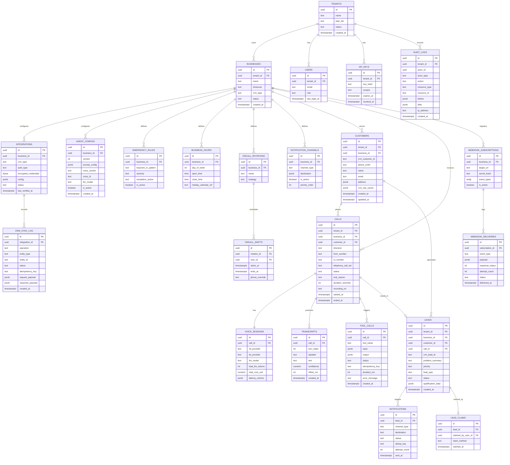

# 06 — Database Schema

Primary store: **PostgreSQL 16+**. Every tenant-scoped table has `tenant_id uuid NOT NULL` and a Row-Level Security policy (`USING (tenant_id = current_setting('app.tenant_id')::uuid)`), set by the connection middleware at the start of every request/call session. This is defense in depth on top of application-layer scoping — a bug in a repository's `WHERE` clause cannot leak cross-tenant data.

## 1. ER diagram

## 2. Notes on key design decisions

- **`customers.crm_customer_id` + unique index on `(business_id, phone_e164)`**: the phone-based dedup lookup (see [05-crm-integration.md](05-crm-integration.md) §4) is a DB-level unique constraint, not just an application check — this is what actually prevents duplicate customers under concurrent calls from the same number (e.g. someone calls twice within seconds because the first call dropped).
- **`customers.crm_raw_cache`**: a JSONB cache of the last-fetched CRM record, refreshed on read with a TTL. Avoids a live CRM API round-trip on every conversation turn that needs customer context, while `crm_customer_id` remains the source of truth pointer.
- **`leads.status`**: enum `new → notified → claimed → (converted_to_job | expired | duplicate)`. `converted_to_job` is set by a webhook from the CRM once a human actually schedules it — closing the loop for reporting without the AI ever touching scheduling.
- **`tool_calls` table is the AI audit trail**: every tool invocation, its exact input/output, and its idempotency key are recorded, independent of the LLM provider's own logs. This is what makes a support ticket ("why did the AI say X") answerable from our own data.
- **`voice_sessions.latency_metrics`**: JSONB rather than fixed columns because the fields captured (STT latency, LLM TTFT, TTS TTFB, barge-in count, etc.) will grow as the pipeline is tuned — see [08-security-observability-reliability.md](08-security-observability-reliability.md) for what's captured and why.
- **Soft multi-tenancy plus RLS, not schema-per-tenant**: schema-per-tenant (or DB-per-tenant) is tempting for "true" isolation but multiplies migration complexity linearly with tenant count and makes cross-tenant analytics (needed for the platform's own product metrics) require fan-out queries. RLS + shared schema is the standard, proven pattern (Supabase, most B2B SaaS) for this scale; DB-per-large-tenant remains an option for a future enterprise tier without a schema rewrite, since the ORM layer is already tenant-aware.
- **`audit_logs` is append-only** (`REVOKE UPDATE, DELETE` at the DB role level) — required for the GDPR/SOC2 posture in [08-security-observability-reliability.md](08-security-observability-reliability.md).
- **Prisma is the ORM** (see [stack rationale in 10](10-deployment-cicd.md)); the schema above maps close to 1:1 to `schema.prisma` models, with RLS policies applied via raw SQL migrations since Prisma doesn't manage RLS natively.

## 3. Indexing strategy (hot paths)

| Query                                     | Index                                                                                                       |
| ----------------------------------------- | ----------------------------------------------------------------------------------------------------------- |
| Find customer by phone during active call | `UNIQUE (business_id, phone_e164)` on `customers`                                                           |
| Load recent transcript for context window | `(call_id, turn_index)` on `transcripts`                                                                    |
| Lead inbox / claim UI                     | `(business_id, status, created_at DESC)` on `leads`                                                         |
| Outbox/webhook relay polling              | `(status, created_at)` partial index `WHERE status = 'pending'` on `webhook_deliveries` and `notifications` |
| Tenant-scoped everything                  | every FK column + RLS predicate column (`tenant_id`) indexed                                                |

## 4. Retention & partitioning

`transcripts`, `tool_calls`, and `crm_sync_log` are high-volume, append-mostly tables — partitioned by month (Postgres native declarative partitioning) from day one so retention policies (e.g. "raw transcripts kept 2 years, then archived to S3 as compressed JSONL and dropped from Postgres") are a partition-drop, not a `DELETE` that locks a huge table.
