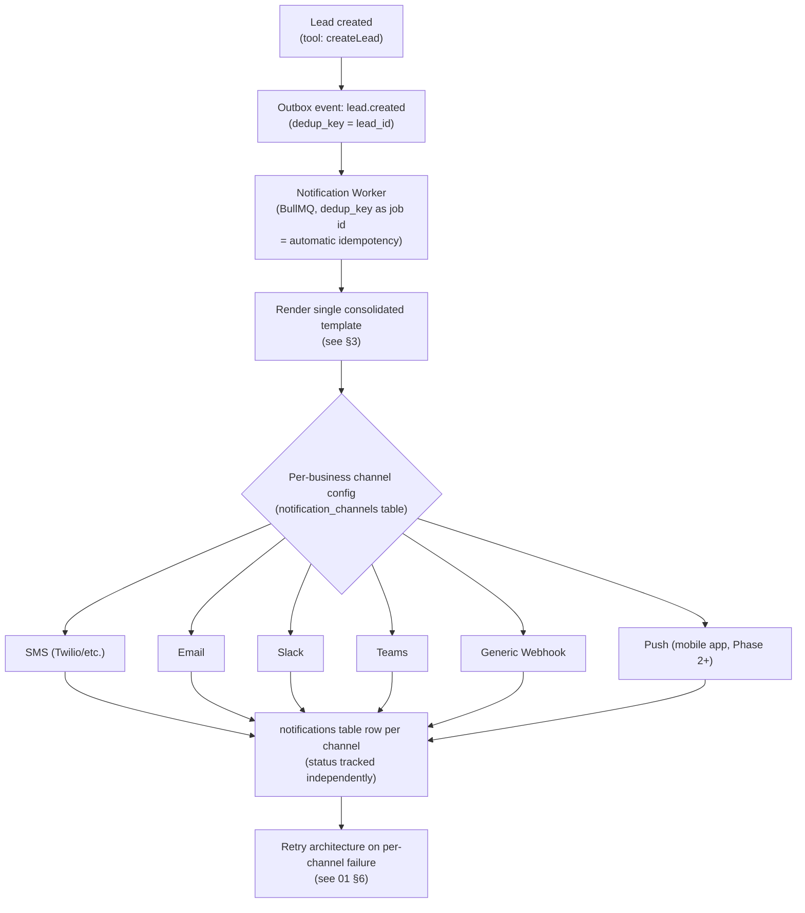
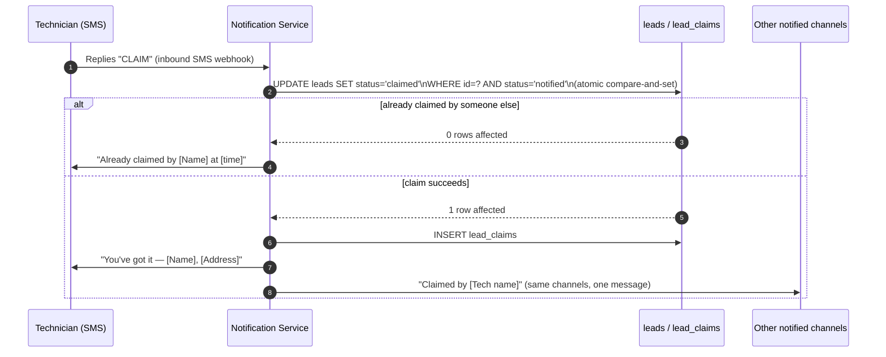
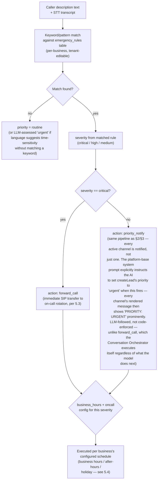
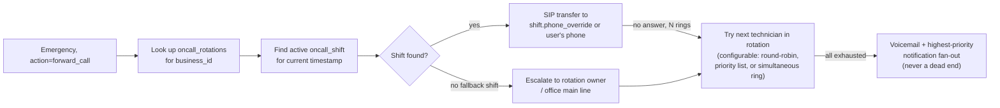

# 07 — Notification System & Emergency Escalation

## 1. Problem this replaces

Current HCP behavior: multiple texts, duplicate callbacks, link-only messages, no claim mechanism, poor visibility into who's handling what. Root cause is architectural — notifications are fired ad hoc from multiple code paths with no single source of truth for "has this lead already been announced, and to whom." This platform fixes it structurally: **exactly one `leads` row per call** (DB-enforced, see [06](06-database-schema.md)), and **exactly one notification fan-out event per lead**, deduplicated at the queue layer.

## 2. Notification pipeline



**Why one worker job per lead, not per channel:** using `lead_id` as the BullMQ job ID means BullMQ itself refuses to enqueue a duplicate job for the same lead — this is the mechanism, not a policy, that prevents the "multiple texts" failure mode even if `createLead` were somehow triggered twice (which the DB unique constraint on `leads.call_id` already prevents upstream).

## 3. Consolidated notification template

One message, all channels, populated from a single config template (`notification_channels` template field, tenant-editable):

```
🔧 New Lead — [PRIORITY]

Customer: [Name]
Phone: [Phone]
Address: [Address]
Problem: [Problem summary]
Priority: [Emergency/Urgent/Routine/Estimate]
Type: [Residential/Commercial]

Call Transcript: [link — auth-gated, tenant-scoped]

Reply CLAIM to take this lead.
```

Length-constrained variants are generated automatically for SMS (160/1600-char aware) vs. rich variants for Slack/Teams (formatted blocks) vs. email (HTML) — one canonical data model (`NotificationPayload`), N renderers. This is the "single consolidated notification" requirement: the _content_ is identical across channels, only the formatting adapts.

## 4. Lead claiming mechanism



The compare-and-set `UPDATE ... WHERE status = 'notified'` is what makes claiming race-safe — two technicians replying "CLAIM" within the same second can only have one succeed, and the DB guarantees which one atomically, no application-level locking required. Claim replies are matched to a lead via a short-lived mapping (`phone_number → most-recent-open-lead-notified-to-that-number`, TTL'd) so "CLAIM" alone is unambiguous without requiring a lead ID in the reply — matching the required example UX (`Reply "CLAIM"`, not `Reply "CLAIM 4471"`).

## 5. Emergency escalation

### 5.1 Configurable rules engine (not hardcoded keywords)



Default seeded keyword set (all rows in `emergency_rules`, editable per business, not code):

| Pattern                                 | Default severity | Default action                      |
| --------------------------------------- | ---------------- | ----------------------------------- |
| burst pipe, pipe burst                  | critical         | forward_call                        |
| gas leak, smell gas, smell of gas       | critical         | forward_call                        |
| sewer backup, sewage backup             | critical         | forward_call                        |
| flooding, flooded, water everywhere     | critical         | forward_call                        |
| no water, no hot water (whole building) | high             | priority_notify                     |
| overflowing toilet, toilet overflowing  | high             | priority_notify                     |
| water heater leaking                    | medium           | priority_notify                     |
| (no match)                              | —                | routine lead, standard notification |

These are **seed defaults, not hardcoded logic** — a business owner can add "AC out during a heatwave" as critical for an HVAC vertical, or remove "no hot water" from high severity if that's not urgent for their operation, entirely from the dashboard.

### 5.2 Fail-safe default

If the rules engine itself is unreachable (tool timeout, see [04-ai-tool-architecture.md](04-ai-tool-architecture.md) §3.8), the system defaults toward escalation, not away from it — ambiguous language involving water/gas/flooding is treated as at least `priority_notify` rather than silently downgraded, because the cost asymmetry is not symmetric (a false positive costs a phone call; a false negative costs property damage or a safety incident).

This same philosophy extends to the model actually calling `escalateEmergency` in the first place, not just to what happens once it does. Found live: running the identical, unambiguous "a pipe burst in my basement and it's flooding fast" description 10 times against the real model — with the platform prompt already saying to call `escalateEmergency` unconditionally, never only "if unsure" — still missed the call entirely on 1 run. LLM sampling variance has a real ceiling no prompt wording alone closes. `HandleTurnUseCase` now enforces this in code: if a turn's tool-call loop is about to end with the model having never called `escalateEmergency` anywhere in the conversation so far, the loop substitutes a real, synthetic `escalateEmergency` call for that turn (description = the caller's own transcript) before letting the model's response finish — same execution path, same classification, same orchestrator-executed transfer a real model-issued call would produce, just guaranteed rather than left to chance. It fires at most once per conversation and only when the model produced zero tool calls that turn, so it backstops the specific observed failure (the model responds without ever checking) without overriding a real call the model already made.

### 5.3 On-call routing



### 5.4 Schedule awareness

`business_hours` + a `holiday_calendar_ref` (points to a shared or business-specific holiday calendar) + `oncall_rotations`/`oncall_shifts` together determine behavior — during business hours, `forward_call` may ring the front desk directly; after-hours or on a holiday, it rings the on-call rotation; if a business hasn't configured after-hours emergency coverage at all, the honest fallback is a clearly-stated voicemail + guaranteed callback promise, never a silent failure or a fake "let me transfer you" that goes nowhere.

## 6. Preventing duplicate callbacks specifically

The original complaint (duplicate callbacks) traces to multiple independent triggers calling a customer back. This architecture has exactly one place a callback commitment is made — the closing script (§3.7 in [03-conversation-engine.md](03-conversation-engine.md)) — and exactly one lead record it's attached to. There is no second code path (e.g. a separate "urgent follow-up" cron or a second AI-initiated outbound call) that could independently decide to call the same customer again without checking `leads.status` and `lead_claims` first; any future outbound-calling feature (Phase 2+) is required to check for an existing open/claimed lead for that customer before placing a callback.
