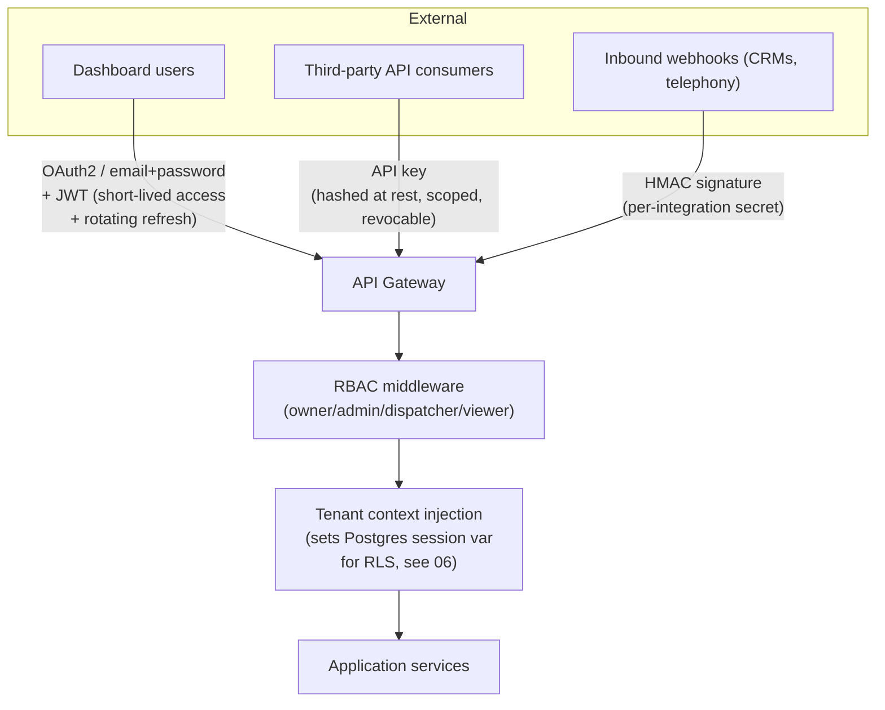

# 08 — Security, Observability & Reliability

## 1. Security architecture

### 1.1 Identity & access

- **JWT** for the admin dashboard: short-lived access token (15 min), rotating refresh token (httpOnly, secure cookie), revocation list in Redis for immediate logout/compromise response.
- **OAuth2** for CRM integrations where the CRM supports it (per-tenant token, refreshed automatically, stored encrypted — see §1.2).
- **API keys** for platform API consumers (future partner integrations): hashed at rest (never stored plaintext, never logged), scoped to specific permissions (read-only leads, webhook management, etc.), independently revocable per key without affecting others.
- **RBAC roles**: `owner` (billing, integration config, user management), `admin` (business config, emergency rules, agent config), `dispatcher` (lead inbox, claiming, notifications), `viewer` (read-only reporting). Enforced at the API layer via a decorator/guard checked against the authenticated user's role for the resource's `tenant_id`/`business_id`.

### 1.2 Secrets & encryption

- **At rest**: CRM credentials (`integrations.encrypted_credentials`) use envelope encryption — a per-tenant Data Encryption Key (DEK) generated by AWS KMS, itself encrypted by a master Key Encryption Key (KEK) that never leaves KMS. Rotating a tenant's DEK doesn't require touching KMS-side keys.
- **In transit**: TLS 1.2+ everywhere, including internal service-to-service traffic inside the cluster (mTLS via service mesh once the platform justifies that operational overhead — Phase 3, see [11-roadmap-risks-future.md](11-roadmap-risks-future.md); Phase 1 relies on the VPC's private networking + TLS at ingress).
- **Secrets management**: AWS Secrets Manager for infra-level secrets (DB credentials, third-party API keys used platform-wide); tenant-level secrets live in the encrypted DB column above, not in Secrets Manager (that doesn't scale to thousands of tenants and isn't its purpose).

### 1.3 Webhook & inbound verification

Every inbound webhook (from a CRM, from the telephony/voice vendor, from an SMS provider's inbound-message webhook) is verified via HMAC signature against a per-integration secret before its payload is trusted (see [01-architecture-overview.md](01-architecture-overview.md) §7). Unsigned or invalid-signature requests are rejected with no side effects and logged for anomaly monitoring.

### 1.4 PII handling

- PII (name, phone, address, email, call recordings, transcripts) is tagged at the schema level (a `pii: true` marker used by the logging middleware) so structured logs shipped to observability tooling are automatically redacted (`+1***-***-4567` style masking) — engineers can debug a call from trace IDs without a third-party observability vendor ever holding raw PII.
- Call recordings and transcripts are encrypted at rest in S3 (SSE-KMS) and access-logged; retrieval requires an authenticated, RBAC-checked request, and every retrieval is itself an audit-logged event.
- **GDPR/CCPA readiness**: `customers` supports a `deleted_at` soft-delete plus a hard-delete job that also purges associated `transcripts`/`calls`/`leads` PII fields (replacing free text with `[redacted]`) while preserving anonymized aggregate rows for analytics — right-to-erasure is a designed workflow, not an afterthought bolted on when a tenant's customer first requests it.

### 1.5 Rate limiting & abuse prevention

Token-bucket rate limiting at two layers: (1) API gateway, per-tenant and per-API-key, protecting the platform itself; (2) tool broker, per-tenant, protecting shared upstream CRM API rate limits from being exhausted by one tenant's traffic spike (see [04-ai-tool-architecture.md](04-ai-tool-architecture.md) §4).

### 1.6 Tenant isolation

Covered in depth in [06-database-schema.md](06-database-schema.md) §1 and [01-architecture-overview.md](01-architecture-overview.md) §10 — Postgres RLS as the enforced boundary, not just application-layer discipline.

### 1.7 Audit logging

`audit_logs` (append-only, `REVOKE UPDATE, DELETE`) records every state-changing action across the platform — config changes, user permission changes, integration credential updates, manual lead edits — with before/after diffs, actor, and IP. This is both a security control (detect unauthorized changes) and a support tool (answer "who changed the emergency keyword list").

## 2. Observability

### 2.1 Stack

**OpenTelemetry** as the vendor-neutral instrumentation layer everywhere (avoids locking the entire codebase to one vendor's SDK) → OTel Collector → **Grafana stack** (Tempo for traces, Loki for logs, Prometheus/Mimir for metrics, Grafana for dashboards) self-hosted as its own ECS Fargate service alongside the rest of the platform (per the ECS-first decision in [01](01-architecture-overview.md) §9, [20-architecture-decision-records.md](20-architecture-decision-records.md) ADR-006), with the option to dual-ship to Datadog/Honeycomb later purely via collector config (no application code changes) once budget supports a managed vendor at higher tenant scale.

### 2.2 What's captured on every call

- **Traces**: one trace per call, spans for STT/LLM/TTS/each tool call, attributes `tenant_id`, `business_id`, `call_id`, `conversation_turn_id` on every span — a support engineer can pull up one trace and see the entire call's timing and decisions.
- **Voice quality metrics** (`voice_sessions.latency_metrics` + Prometheus histograms): time-to-first-audio-byte, STT partial-transcript latency, LLM time-to-first-token, TTS time-to-first-byte, barge-in count per call, silence-recovery-prompt count per call, call abandonment point (state machine state at hangup).
- **Token usage & cost**: per-call LLM token counts (input/output), STT audio-seconds, TTS characters, all rolled up to `voice_sessions.total_cost_usd` — feeds directly into [09-cost-analysis.md](09-cost-analysis.md)'s per-call cost model and lets a per-tenant cost dashboard exist from day one.
- **Business metrics**: leads created/claimed/expired per business per day, emergency escalation count, average time-to-claim, notification delivery success rate per channel.

### 2.3 Alerting

- **Latency SLO breach**: p95 time-to-first-response-audio > 1.2s sustained for 5 min → page on-call.
- **Failure-mode alerts**: CRM adapter circuit breaker open, webhook DLQ depth > threshold, notification delivery failure rate > 5% in 10 min, voice vendor connection failures spiking.
- **Cost anomaly**: a tenant's daily LLM/voice spend deviating >3x from its trailing 7-day average (catches both runaway bugs and legitimate growth that should trigger a billing-tier conversation).

### 2.4 Health checks

Standard `/healthz` (liveness) and `/readyz` (readiness, checks DB/Redis connectivity) on every service, plus a synthetic canary call placed through the full voice pipeline on a schedule (e.g. every 15 min) to catch "the API is up but the actual voice pipeline is silently broken" — a failure mode pure infra health checks cannot see.

## 3. Reliability patterns

| Pattern                                                 | Where applied                                                                                                        | Why                                                                                                                                                                                                                  |
| ------------------------------------------------------- | -------------------------------------------------------------------------------------------------------------------- | -------------------------------------------------------------------------------------------------------------------------------------------------------------------------------------------------------------------- |
| **Retry with exponential backoff + jitter**             | All CRM writes, notification delivery, webhook delivery                                                              | See [01](01-architecture-overview.md) §6 — transient failures self-heal without manual intervention.                                                                                                                 |
| **Circuit breaker** (per tenant × per CRM adapter)      | CRM Adapter Layer                                                                                                    | One tenant's misconfigured/down CRM integration degrades to "queue and retry" instead of every request against that adapter hanging until timeout, which would otherwise exhaust worker pool capacity platform-wide. |
| **Dead letter queue + manual replay**                   | All BullMQ queues                                                                                                    | Permanent failures (bad data, revoked auth) don't retry forever or silently vanish — they're visible and actionable in the admin dashboard.                                                                          |
| **Timeouts on every external call**                     | Every tool (§ per-tool budgets in [04](04-ai-tool-architecture.md)), every CRM adapter method                        | No external dependency can hang the conversation indefinitely.                                                                                                                                                       |
| **Graceful degradation**                                | Every tool has a defined fallback behavior on failure (cached data, conservative default, or explicit degraded flag) | The call continues even when a dependency is down — see [04](04-ai-tool-architecture.md) §3 per-tool tables.                                                                                                         |
| **Voice reconnect**                                     | Voice Gateway ↔ Conversation Orchestrator WebSocket                                                                  | Transient network blip mid-call triggers automatic reconnect with conversation state preserved in Redis (keyed by `call_id`), not a dropped call.                                                                    |
| **Database failover**                                   | RDS Multi-AZ                                                                                                         | Automatic failover to standby on primary failure, sub-60s typically, application layer retries transient connection errors.                                                                                          |
| **Rolling/blue-green deploys with connection draining** | Voice-orchestrator deployment specifically                                                                           | Long-lived WebSocket calls must finish on the old pod version before it's terminated — a naive rolling restart would drop live calls; see [10-deployment-cicd.md](10-deployment-cicd.md).                            |
| **Idempotency everywhere writes happen**                | See [04](04-ai-tool-architecture.md) per-tool idempotency keys                                                       | Retries after partial failure (e.g. CRM accepted the write but the response was lost to a timeout) never double-create.                                                                                              |
