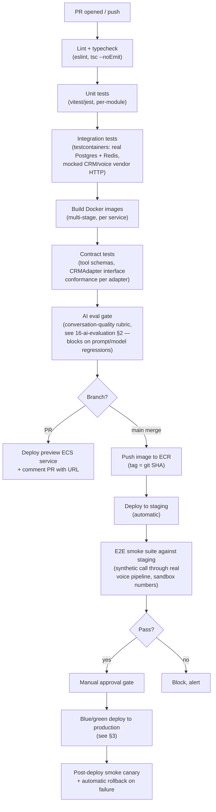
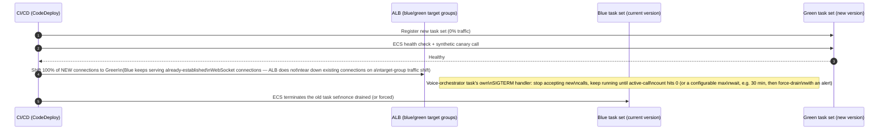

# 10 — Deployment & CI/CD

Deployment architecture diagram lives in [01-architecture-overview.md](01-architecture-overview.md) §9 — this doc covers environments, pipeline, and operational procedures. Stack rationale and code standards are in [14-backend-stack-and-code-standards.md](14-backend-stack-and-code-standards.md). **Orchestration platform is ECS Fargate for Phase 1-2, with a documented, evidence-based trigger to migrate to EKS — see [20-architecture-decision-records.md](20-architecture-decision-records.md) ADR-006 for the full reasoning behind this reversal from an earlier Kubernetes-first draft.**

## 1. Environments

| Environment  | Purpose                                                                      | Infra                                                                                                                                                                                                 |
| ------------ | ---------------------------------------------------------------------------- | ----------------------------------------------------------------------------------------------------------------------------------------------------------------------------------------------------- |
| `local`      | Developer machines                                                           | Docker Compose (Postgres, Redis, mock CRM adapter, mock voice vendor sandbox)                                                                                                                         |
| `preview`    | Per-PR ephemeral environment                                                 | Spun up on PR open (ephemeral ECS service in a shared "preview" cluster, one task each for core-api/voice-orchestrator/workers, pointed at a scoped/seeded Postgres schema), torn down on merge/close |
| `staging`    | Pre-prod, mirrors prod config, uses sandbox/test CRM + voice vendor accounts | Dedicated ECS cluster, smaller task counts                                                                                                                                                            |
| `production` | Live tenant traffic                                                          | Full ECS Fargate cluster per [01](01-architecture-overview.md) §9                                                                                                                                     |

## 2. CI/CD pipeline (GitHub Actions)

- **Contract tests for CRM adapters** deserve emphasis: every adapter (`HcpAdapter`, `ServiceTitanAdapter`, etc.) is tested against the same shared test suite that asserts conformance to the `CRMAdapter` interface contract (e.g. "searchCustomer with no match returns `{found:false}`, never throws"), so a new adapter can't silently violate an assumption the tool broker depends on.
- **E2E smoke suite** places an actual test call through the real voice pipeline against a sandbox phone number before every production deploy — catches integration regressions that unit/integration tests structurally cannot (vendor SDK changes, prompt regressions, actual audio pipeline issues).
- **AI eval gate** is a distinct CI stage from unit/integration tests — any change to `agent_configs.prompt_config` templates or the LLM Gateway's model routing runs the scripted-persona eval suite ([16-ai-evaluation-prompt-versioning-feature-flags.md](16-ai-evaluation-prompt-versioning-feature-flags.md) §2) and blocks merge on a rubric-score regression, not just on code compiling.

## 3. Blue/green deployment for the voice-orchestrator specifically

The voice-orchestrator holds long-lived WebSocket connections for active calls — a naive rolling deploy would drop live calls mid-conversation. On ECS, this uses **CodeDeploy's blue/green deployment type for ECS services** (two target groups, traffic shifted at the ALB, not a Kubernetes-specific mechanism):

The task-level graceful-drain behavior (stop accepting new calls, finish in-flight ones, then exit) is application code — a `SIGTERM` handler in the voice-orchestrator process — not infrastructure-specific, so it's identical whether the task runs on Fargate today or a Kubernetes pod after the ADR-006 migration trigger fires; only the surrounding orchestration (CodeDeploy vs. a `PodDisruptionBudget`) differs.

Other services (`core-api`, workers) use standard ECS rolling deployments (`minimumHealthyPercent: 100`, `maximumPercent: 200`) — they're stateless per-request, so no draining logic is needed.

## 4. Rollback

Every deploy is tagged with the git SHA; rollback is either a CodeDeploy-native rollback (for the voice-orchestrator's blue/green deployments — shift traffic back to the still-warm Blue target group, near-instant) or re-running the pipeline against the previous known-good SHA's already-built image for standard rolling-deploy services (images are immutable and retained in ECR per a retention policy, e.g. last 90 days). Database migrations are written to be backward-compatible for at least one release (additive changes deployed ahead of the code that uses them; destructive changes — column drops — are a separate, later migration only after the code no longer references the column), so a code rollback never requires a matching destructive-migration rollback. This expand/contract discipline is enforced by a CI migration-lint step (a migration that drops/renames a column in the same PR as code still referencing it fails CI) — full schema-evolution and CRM-migration procedures are in [15-tenant-lifecycle-billing-and-analytics.md](15-tenant-lifecycle-billing-and-analytics.md) §5.

## 5. Infrastructure as Code

Terraform for all AWS resources (ECS cluster/services/task definitions, RDS, ElastiCache, S3, IAM, Secrets Manager, VPC/networking, CodeDeploy applications) — no manually-created infrastructure, so environments are reproducible and disaster recovery (rebuild in a new region/account, see [17-disaster-recovery-multi-region-compliance.md](17-disaster-recovery-multi-region-compliance.md)) is a `terraform apply`, not institutional knowledge. Task/service definitions are parameterized per environment via Terraform workspaces/variables — no Helm charts or Kubernetes manifests exist until the ADR-006 migration trigger fires, at which point the containerized application images are unchanged and only the orchestration-layer Terraform/Helm changes.

## 6. Load balancing & autoscaling

- **ALB** in front of `core-api` and the dashboard, with path-based routing to the correct ECS service; standard target-tracking autoscaling on request count/CPU via Application Auto Scaling.
- **Voice-orchestrator autoscaling** is on a **custom metric** — the task publishes its own `ActiveCallCount` to CloudWatch, and Application Auto Scaling target-tracks on it directly (no Prometheus adapter needed — this is a first-class Application Auto Scaling feature, not a workaround) — since CPU% is a poor proxy for "can this task accept another call" (a task holding 40 quiet calls looks CPU-idle but may be near its connection-count ceiling).
- **Cloudflare** in front of everything public-facing: DDoS protection, WAF rules (rate limiting login attempts, blocking known bad IP ranges — see also the telephony-specific abuse controls in [18-abuse-prevention-and-telephony-fraud.md](18-abuse-prevention-and-telephony-fraud.md)), CDN for the dashboard's static assets, and DNS.

## 7. Secrets in CI/CD

GitHub Actions OIDC federation to AWS (no long-lived AWS access keys stored in GitHub secrets) for deploy permissions; application secrets are referenced directly from Secrets Manager in the ECS task definition (native `secrets` block, resolved by the ECS agent at task-start, never baked into images or committed to the repo) — this is simpler than the Kubernetes equivalent (External Secrets Operator) and is one of the concrete, if minor, operational-simplicity wins of the Fargate-first decision in ADR-006.
