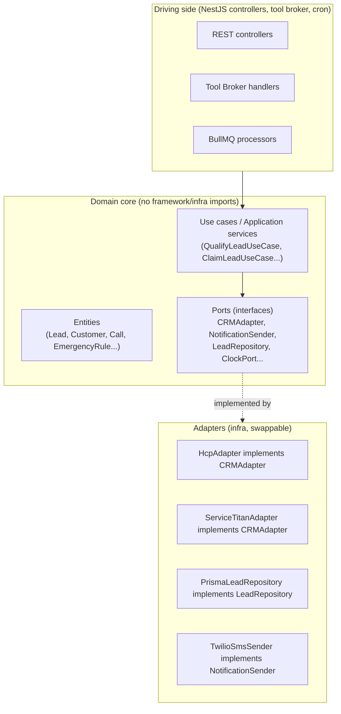

# 14 — Backend Stack & Code Standards

## 1. Recommended stack

| Layer                                                  | Choice                                                                                         | Why                                                                                                                                                                                                                                                                                                                                                                                                                                                                                                                                                                                                       |
| ------------------------------------------------------ | ---------------------------------------------------------------------------------------------- | --------------------------------------------------------------------------------------------------------------------------------------------------------------------------------------------------------------------------------------------------------------------------------------------------------------------------------------------------------------------------------------------------------------------------------------------------------------------------------------------------------------------------------------------------------------------------------------------------------- |
| Language                                               | **TypeScript**, strict mode                                                                    | Type safety across the tool broker's schema boundaries (LLM output → validated args → CRM adapter) is exactly where untyped code causes the most expensive bugs — a malformed tool call reaching a CRM write. Strict mode (`strict: true`, `noUncheckedIndexedAccess`, `exactOptionalPropertyTypes`) is non-negotiable given how much of this domain is "data crossing a trust boundary."                                                                                                                                                                                                                 |
| Core API framework                                     | **NestJS**                                                                                     | Its module system maps directly onto this platform's domain boundaries (a `LeadsModule`, `CrmModule`, `NotificationsModule`, each with its own controllers/services/repositories) and its dependency-injection container is what makes the Hexagonal Architecture in §2 practical to enforce rather than aspirational. Built-in support for guards (RBAC), interceptors (logging/tracing), pipes (validation) covers most of the security/observability cross-cutting concerns in [08](08-security-observability-reliability.md) with framework primitives instead of hand-rolled middleware.             |
| Voice orchestrator runtime                             | **Node.js + LiveKit Agents (`agents-js`)**, standalone service, not inside the NestJS monolith | Long-lived WebSocket/room-participant processes with custom autoscaling (see [01](01-architecture-overview.md) §9) have a different operational profile than the stateless request/response Core API — deploying, scaling, and doing connection-draining independently is simpler as a separate service than as a NestJS module sharing a process/deploy lifecycle with the REST API.                                                                                                                                                                                                                     |
| High-throughput internal endpoints (webhook receivers) | **Fastify** (used as NestJS's underlying HTTP adapter, `@nestjs/platform-fastify`)             | Webhook ingestion (inbound from CRMs/telephony vendor) is a high-volume, latency-sensitive path where Fastify's lower per-request overhead vs. Express matters; using it as NestJS's adapter means one framework, no second app to maintain.                                                                                                                                                                                                                                                                                                                                                              |
| Cache / session state / queues                         | **Redis** (ElastiCache)                                                                        | Serves three roles at once — conversation short-term memory (§ in [03](03-conversation-engine.md)), rate-limit token buckets ([04](04-ai-tool-architecture.md) §4, [08](08-security-observability-reliability.md) §1.5), and the BullMQ queue backend — one piece of infrastructure instead of three.                                                                                                                                                                                                                                                                                                     |
| Primary database                                       | **PostgreSQL** (RDS)                                                                           | Row-Level Security for tenant isolation ([06](06-database-schema.md) §1), native JSONB for flexible config (`prompt_config`, `qualification_data`) without needing a second document store, native declarative partitioning for high-volume tables, and mature Multi-AZ failover.                                                                                                                                                                                                                                                                                                                         |
| ORM                                                    | **Prisma**                                                                                     | Type-safe query builder generated from schema keeps the DB schema and TypeScript types in lockstep — a schema change that breaks a query is a compile error, not a runtime surprise in production. Its migration tooling is used for structural changes; RLS policies and partitioning are applied via accompanying raw SQL migrations since Prisma doesn't model those natively (documented as a known gap, tracked in [13](13-implementation-backlog.md)).                                                                                                                                              |
| Job queue                                              | **BullMQ** (on Redis)                                                                          | Backs the outbox relay, notification worker, CRM sync worker, and webhook delivery worker (see [01](01-architecture-overview.md) §§5-7) — built-in retry/backoff, delayed jobs, and job-ID-based deduplication (used directly for the "one notification per lead" guarantee in [07](07-notification-and-emergency.md) §2).                                                                                                                                                                                                                                                                                |
| Containerization                                       | **Docker**, multi-stage builds                                                                 | Reproducible builds across local/CI/prod; multi-stage keeps production images free of dev dependencies and build tooling.                                                                                                                                                                                                                                                                                                                                                                                                                                                                                 |
| Orchestration                                          | **ECS Fargate** for Phase 1-2; **Kubernetes (EKS)** deferred to an evidence-based trigger      | Originally specified as EKS from day one; reversed on critical review — the custom-metric autoscaling and graceful-drain requirements that motivated Kubernetes are native ECS Fargate capabilities (Application Auto Scaling target-tracking, `deploymentConfiguration` + task-level `SIGTERM` drain), at meaningfully lower operational overhead for a pre-PMF team. Full reasoning and the exact conditions that trigger a migration to EKS: [20-architecture-decision-records.md](20-architecture-decision-records.md) ADR-006, [01](01-architecture-overview.md) §9, [10](10-deployment-cicd.md) §3. |
| Ingress / edge                                         | **ALB** + **Cloudflare**                                                                       | Cloudflare for DNS/WAF/DDoS/CDN at the internet edge; ALB for routing and TLS termination to ECS services. (An NGINX/ALB Ingress Controller becomes relevant again only if/when the EKS migration trigger in ADR-006 fires.)                                                                                                                                                                                                                                                                                                                                                                              |

## 2. Architectural style: Hexagonal (Ports & Adapters) + Clean Architecture layering



**Why this over a typical layered NestJS app (controller → service → Prisma directly):** the entire premise of this platform is CRM-agnosticism (see [05-crm-integration.md](05-crm-integration.md)) — the `QualifyLeadUseCase` must be able to call `crmAdapter.createLead()` without knowing or caring whether that resolves to `HcpAdapter` or `ServiceTitanAdapter` at runtime (resolved via the tenant's `integrations.crm_type`, injected by a NestJS custom provider factory). A typical layered app that calls the HCP SDK directly from a service class would need that logic duplicated or branched with `if (crmType === 'hcp')` conditionals scattered across the codebase every time a second CRM is added — the port/adapter boundary is what keeps adding ServiceTitan support an additive change (`new ServiceTitanAdapter()` + a registration line) rather than a refactor of existing, working HCP code.

## 3. SOLID in practice for this codebase

- **Single Responsibility**: a `CRMAdapter` implementation only translates between the domain model and one CRM's API shape — it never contains qualification logic, escalation logic, or notification logic (those live in application services that depend on the adapter, not the reverse).
- **Open/Closed**: adding a 4th, 5th CRM never modifies `QualifyLeadUseCase` or the tool broker — only adds a new adapter class satisfying the existing `CRMAdapter` interface.
- **Liskov Substitution**: the contract tests in [10-deployment-cicd.md](10-deployment-cicd.md) §2 exist specifically to guarantee every `CRMAdapter` implementation is truly interchangeable (e.g. "searchCustomer never throws on not-found, always returns `{found:false}`") — a Liskov violation here (one adapter throwing where others return a value) is exactly the kind of bug that would otherwise only surface in production against one specific tenant's CRM.
- **Interface Segregation**: `CRMAdapter` is actually composed of narrower interfaces (`CustomerPort`, `LeadPort`, `NotePort`) so an adapter for a CRM that doesn't support, say, custom fields isn't forced to implement a fat interface with stub/throwing methods.
- **Dependency Inversion**: application services depend on the `PORTS` interfaces defined in the domain layer, never on a concrete Prisma repository or a concrete HCP SDK client — those are injected via NestJS's DI container, configured per-tenant at request time.

## 4. Repository pattern

Every entity has a repository interface in the domain layer (`LeadRepository`, `CustomerRepository`) and a Prisma-backed implementation in the adapters layer. This is what makes the unit test suite for use cases fast and CRM/DB-independent (in-memory fake repositories), while integration tests (see §6) exercise the real Prisma implementation against a real (testcontainers) Postgres.

## 5. Feature-based module structure

```
src/
  modules/
    calls/            # Call lifecycle, voice session tracking
    leads/             # Lead qualification, claiming, status
    customers/          # Customer search/dedup/creation
    crm-integration/     # CRMAdapter interface + all adapters
      adapters/
        housecall-pro/
        service-titan/
        jobber/
    notifications/       # Consolidated notification pipeline
    emergency-rules/      # Configurable escalation engine
    tenants/             # Tenant/business/config CRUD
    auth/                # JWT, API keys, RBAC guards
    tool-broker/          # AI tool registry, validation, execution
    observability/         # OTel setup, custom instrumentation
  shared/
    domain/              # Cross-module entities/value-objects
    kernel/               # Idempotency, outbox, retry utilities
```

Each module owns its controllers, services, repositories, and DTOs — no module reaches into another module's internals directly; cross-module communication goes through exported service interfaces (NestJS module `exports`) or domain events (the outbox, [01](01-architecture-overview.md) §5), keeping the dependency graph acyclic and each module independently testable.

## 6. Testing strategy

| Level                        | Scope                                                                                                                                                           | Tooling                                                                                                                                                  |
| ---------------------------- | --------------------------------------------------------------------------------------------------------------------------------------------------------------- | -------------------------------------------------------------------------------------------------------------------------------------------------------- |
| Unit                         | Use cases, domain logic, tool schema validators — with fake/in-memory repositories and adapters                                                                 | Vitest/Jest                                                                                                                                              |
| Integration                  | Real Postgres + Redis (testcontainers), real Prisma repositories, mocked HTTP for external CRM/telephony/notification vendors                                   | Vitest/Jest + testcontainers + msw/nock                                                                                                                  |
| Contract                     | Every `CRMAdapter` implementation against a shared conformance suite (§2 justification above)                                                                   | Custom shared test suite run per-adapter                                                                                                                 |
| E2E                          | Full request → DB → response through a running NestJS app instance                                                                                              | Supertest against a test app instance                                                                                                                    |
| Voice E2E / synthetic canary | Actual call through the real voice pipeline against a sandbox number, asserting on transcript + tool calls made                                                 | Scheduled job + LiveKit test harness, run pre-deploy and on a recurring schedule in production (see [08](08-security-observability-reliability.md) §2.4) |
| Conversation quality eval    | Scripted persona transcripts run against the LLM Gateway, scored against a rubric (no robotic tics, correct field extraction, correct emergency classification) | Eval harness, tracked as a CI gate on prompt-config changes — see [13-implementation-backlog.md](13-implementation-backlog.md)                           |

No PR merges to `main` without unit + integration + contract tests passing (enforced in the CI pipeline, [10-deployment-cicd.md](10-deployment-cicd.md) §2); E2E and voice-E2E suites gate the staging→production promotion specifically.

## 7. Code review standards

- No `any` in application/domain code (only permitted, with a comment justifying it, at the literal boundary of an untyped third-party SDK response, immediately wrapped in a validated DTO).
- No direct Prisma client usage outside the `adapters` layer — a service importing `PrismaClient` directly is a Hexagonal Architecture violation and blocked by an ESLint boundary rule (`eslint-plugin-boundaries` configured per the module structure in §5).
- Every new tool in the tool broker requires: schema, contract test, entry in [04-ai-tool-architecture.md](04-ai-tool-architecture.md), and an idempotency strategy — a tool PR without all four is incomplete by definition, not a style nitpick.

## 8. API & event-schema versioning, repo governance

Added on review — a platform expected to be maintained by many engineers over years, and to expose a partner API by Phase 4 ([11-roadmap-risks-future.md](11-roadmap-risks-future.md)), needs a stated versioning and ownership policy before the first external consumer depends on an endpoint, not after a breaking change already broke one.

- **REST API versioning**: URL-versioned (`/v1/...`), with the version bumped only on a breaking change (a field removal or type change — additive fields never require a bump, same expand/contract philosophy as the DB migration policy in [15-tenant-lifecycle-billing-and-analytics.md](15-tenant-lifecycle-billing-and-analytics.md) §5.1). An OpenAPI spec generated directly from NestJS decorators is the contract source of truth, not a hand-maintained document that can drift from the actual implementation. Once external (partner API, Phase 4) consumers exist, a deprecated version gets a stated minimum sunset window (e.g. 6-12 months) before removal — internal-only versions (Phase 1-3, no external consumers yet) aren't held to this yet, since there's no one to break.
- **Event schema versioning**: every outbox/domain event ([01-architecture-overview.md](01-architecture-overview.md) §5) carries a `schema_version` field. A breaking change to an event's shape ships as a new version co-existing with the old one for at least one full consumer-deploy cycle, so a consumer temporarily on an older code version doesn't silently misparse a new event shape — the same expand/contract discipline as the database, applied one layer up at the event-bus boundary, and worth stating explicitly since it's easy to assume "the DB migration policy covers this" when it doesn't.
- **Repo governance**: module ownership follows the module boundaries already enforced by the `eslint-plugin-boundaries` rule (§5, §7) — a `CODEOWNERS`-style mapping from `src/modules/*` to the engineer(s) responsible keeps review load distributed as the team grows, rather than every PR routing to whoever's available.
- **The ADR log itself is a living practice, not a one-time artifact**: new architectural decisions — and reversals of old ones, exactly like the Fargate/EKS reversal in [20-architecture-decision-records.md](20-architecture-decision-records.md) ADR-006 — get a new, dated entry appended to that log following its established Context/Decision/Alternatives/Trade-offs/Status/Revisit-trigger format. A past ADR is never edited to look like it was always correct; it's superseded by a new entry that references it, so the record stays an honest audit trail of how the architecture's thinking actually evolved, which is exactly what an external security auditor or a new staff engineer two years from now needs to trust the documentation at all.
