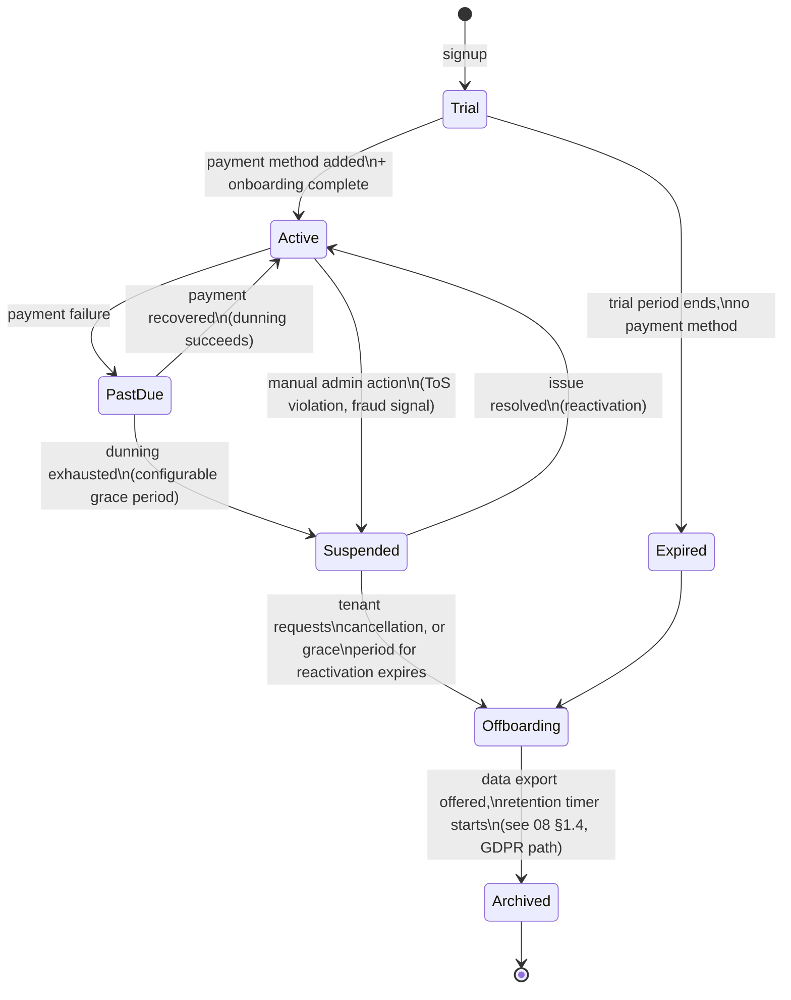
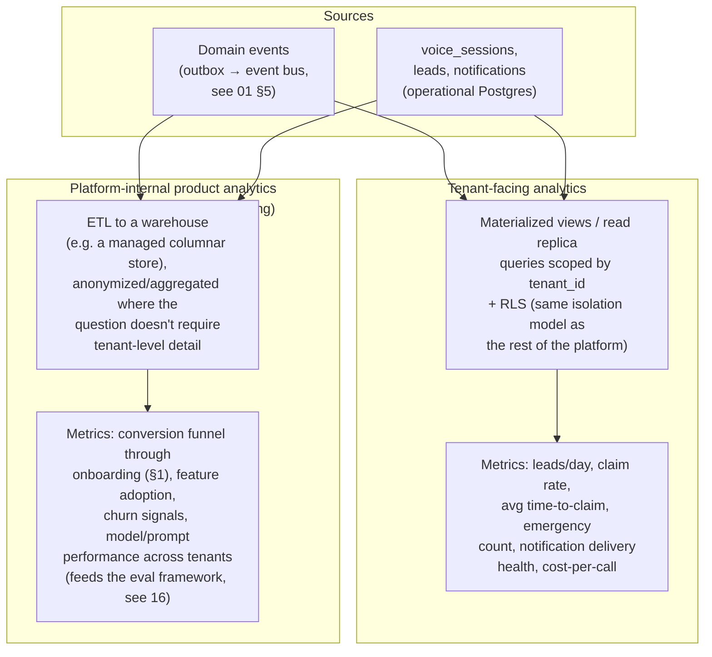
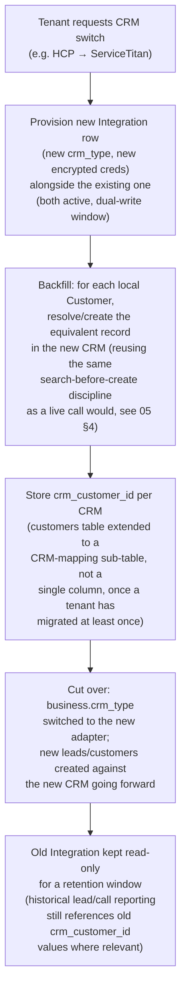

# 15 — Tenant Lifecycle, Onboarding, Billing & Analytics

None of this was in the original brief, but a platform meant to be sold to "hundreds or thousands" of companies doesn't exist as a sellable product until someone can sign up, pay, configure their business, see value, and eventually leave cleanly — this doc closes that gap.

## 1. Onboarding flow

```mermaid
flowchart TB
    A["Signup\n(email/password or Google OAuth)"] --> B["Create Tenant + first Business\n(name, timezone, vertical:\nplumbing/HVAC/electrical/...)"]
    B --> C["Connect CRM\n(select HCP/ServiceTitan/Jobber/...,\nOAuth or API-key entry per 05 §2.1)"]
    C --> D["Verify connection\n(test call: searchCustomer against\na known test record, confirm\ncredentials + adapter both work)"]
    D --> E["Configure business basics\n(business hours, holiday calendar,\nservice areas — see 06)"]
    E --> F["Configure emergency rules\n(seeded defaults per vertical,\nreviewed/edited by the owner —\nnever silently accepted unread)"]
    F --> G["Configure notification channels\n+ on-call rotation"]
    G --> H["Agent config: pick a voice,\nreview/edit greeting + closing\nscript templates"]
    H --> I["Provision phone number\n(port existing or assign new,\nSIP-trunked per 02 §4)"]
    I --> J["Guided test call\n(owner calls the new number,\nlistens to the AI, confirms it\nsounds right before going live)"]
    J --> K["Go live\n(number forwards to the platform,\nor is published directly)"]
    K --> L["Day-1 / Day-7 automated check-in\n(surface early call volume, any\nescalations, invite feedback —\ncatches a bad config fast,\nnot at month-end)"]
```

**Design principle: nothing in this flow is skippable by omission.** The emergency-rules review step (F) is deliberately not "here are sensible defaults, click next" — a new tenant must actively view and confirm (or edit) the seeded keyword list for their vertical, because [11-roadmap-risks-future.md](11-roadmap-risks-future.md)'s risk table treats emergency misclassification as the single highest-cost failure mode, and defaults a tenant never looked at are defaults nobody actually agreed to.

**Self-service vs. white-glove**: Phase 1 (All Phase Plumbing) runs this flow manually, operated by the Ethixweb team on the tenant's behalf — the dashboard UI for it is a Phase 2 deliverable ([11](11-roadmap-risks-future.md) §1). Building the _flow_ correctly now (as an explicit state machine, not ad hoc setup steps) means Phase 2's self-service UI is a frontend for an already-defined backend process, not a redesign.

## 2. Tenant lifecycle states

- **`Suspended` is not `Deleted`**: inbound calls to a suspended tenant's number get an honest, configurable message (default: "this line is temporarily unavailable, please try again later") rather than either silently answering with a degraded/broken AI or a hard hangup — a suspended tenant (e.g. a card decline) shouldn't have their customers experience a mysterious dead line.
- **Archival, not immediate deletion**: on offboarding, tenant data moves to an `Archived` state with a retention timer (configurable, default aligned to the longest applicable regulatory retention requirement) before hard deletion — this both gives a churned tenant a window to reconsider/export their data and avoids an accidental instant, irreversible data loss from a cancellation click.
- **This state machine is enforced in code, not just documented**: the `tenants.status` column transitions are validated against this exact graph (illegal transitions, e.g. `Archived → Active`, rejected at the repository layer) — the same "state machine as executable code, not implied by prompt text" discipline applied to the conversation engine in [03-conversation-engine.md](03-conversation-engine.md) §2 applies here too.

## 3. Billing architecture

### 3.1 Why Stripe, not a custom billing engine

**Recommendation: Stripe Billing (subscriptions + usage-based metering) rather than building billing in-house.** This wasn't in the original brief but is a real architectural decision a principal engineer would flag immediately: billing touches payment card data, tax calculation (Stripe Tax), dunning/retry logic for failed payments, invoicing, and revenue recognition — every one of these is a solved problem with significant compliance surface (PCI DSS) that a startup building a voice-AI product has no business re-solving. Using Stripe as the billing system of record, with this platform's own `billing`/plan tables (see [06-database-schema.md](06-database-schema.md) — extend the `TENANTS.plan_tier` field) as a **cache/mirror of Stripe's state** (synced via Stripe webhooks, the same inbound-webhook signature-verification + idempotent-handler pattern already built for CRM/telephony webhooks in [01-architecture-overview.md](01-architecture-overview.md) §7), keeps this platform entirely out of PCI scope — no card data ever touches Ethixweb's servers, only Stripe's.

### 3.2 Plan model

| Plan dimension     | Approach                                                                                                                                                                                                                                                                                                                                                                                                                                                                             |
| ------------------ | ------------------------------------------------------------------------------------------------------------------------------------------------------------------------------------------------------------------------------------------------------------------------------------------------------------------------------------------------------------------------------------------------------------------------------------------------------------------------------------ |
| Base tier          | Flat monthly fee per business (covers platform access, dashboard, base support)                                                                                                                                                                                                                                                                                                                                                                                                      |
| Usage metering     | Per-minute or per-call overage above a plan's included volume, metered via Stripe's usage-based billing API, fed by the same `voice_sessions.total_cost_usd`/duration data already captured for internal cost tracking ([08-security-observability-reliability.md](08-security-observability-reliability.md) §2.2) — **one metering pipeline serves both the internal cost dashboard and the customer-facing invoice**, not two separate implementations that can drift out of sync. |
| Plan gating        | Feature flags (see [16-ai-evaluation-prompt-versioning-feature-flags.md](16-ai-evaluation-prompt-versioning-feature-flags.md) §3) gate plan-tier-specific capabilities (e.g. number of businesses per tenant, advanced emergency-rule customization, multi-language support) — plan tier is just another flag-targeting dimension, not a separate access-control system.                                                                                                             |
| Overage protection | Per-tenant hard/soft spend caps (configurable), enforced at the same rate-limiter layer already built for abuse prevention ([04-ai-tool-architecture.md](04-ai-tool-architecture.md) §4) — a runaway cost bug or a genuine traffic spike triggers a cost-anomaly alert (already specified in [08](08-security-observability-reliability.md) §2.3) _before_ it becomes a billing dispute.                                                                                             |

### 3.3 What is explicitly out of scope for Phase 1-2

Usage-based pricing experiments (per-lead pricing, success-fee models tied to `lead.converted` webhooks) are a real future option enabled by the data model (a lead's full lifecycle, including CRM-side conversion, is already tracked end-to-end — see [06](06-database-schema.md) `leads.status`) but are deliberately not designed in detail here; billing model experimentation is a business decision to make with real usage data, not something to over-engineer against speculatively (consistent with the "no design for hypothetical future requirements" principle governing this entire codebase).

## 4. Analytics architecture

Two genuinely distinct audiences, deliberately not served by the same pipeline or the same data model:

- **Tenant-facing analytics stay inside the RLS boundary** — they're just scoped queries/materialized views over the same tenant-isolated data every other feature reads from, not a separate system with its own isolation model to get wrong.
- **Platform-internal analytics deliberately go through anonymization/aggregation** where the question at hand doesn't need tenant-level identification (e.g. "what's the average call-abandonment point across all tenants on the platform" doesn't need to be joined back to a specific tenant to be useful) — minimizing how much raw PII a broader internal analytics/BI audience can ever touch, consistent with the PII-handling principles in [08](08-security-observability-reliability.md) §1.4.
- **This is explicitly Phase 2+ scope** ([11-roadmap-risks-future.md](11-roadmap-risks-future.md)) — Phase 1's single pilot tenant doesn't need a warehouse; it needs the operational dashboards already specified in [08](08-security-observability-reliability.md) §2. Building the warehouse ETL early, before there's a second tenant's data to compare against, would be exactly the kind of premature abstraction this project's engineering principles reject.

## 5. Schema evolution & CRM migration procedures

Two related but distinct kinds of "migration" a mature multi-tenant platform must handle without downtime or data loss:

### 5.1 Database schema evolution (expand/contract)

Every schema change ships as two migrations, never one, when the change is destructive or renames anything read by currently-deployed code:

1. **Expand**: add the new column/table/index; backfill; deploy code that writes to _both_ old and new shape (or reads new-with-fallback-to-old).
2. **Contract**: only after the expand-phase code has been running in production for at least one full deploy cycle (confirming no rollback to pre-expand code is needed), a second migration drops the old column/table.

This is the same discipline referenced in [10-deployment-cicd.md](10-deployment-cicd.md) §4's migration-lint CI check — flagged here as the general policy that check enforces.

### 5.2 Tenant CRM migration (e.g. a tenant switches from Housecall Pro to ServiceTitan)

Because all business logic depends only on the `CRMAdapter` interface ([05-crm-integration.md](05-crm-integration.md) §1, [14-backend-stack-and-code-standards.md](14-backend-stack-and-code-standards.md) §2), migrating a tenant's active integration from one CRM to another is a **data migration, not a code migration**:

This isn't built in Phase 1 (no tenant has a second CRM to migrate to yet), but the data model's `customers.crm_customer_id` + `integrations.crm_type` design is deliberately shaped to make this additive (a mapping table) rather than requiring a schema rewrite when the first real migration request arrives.
