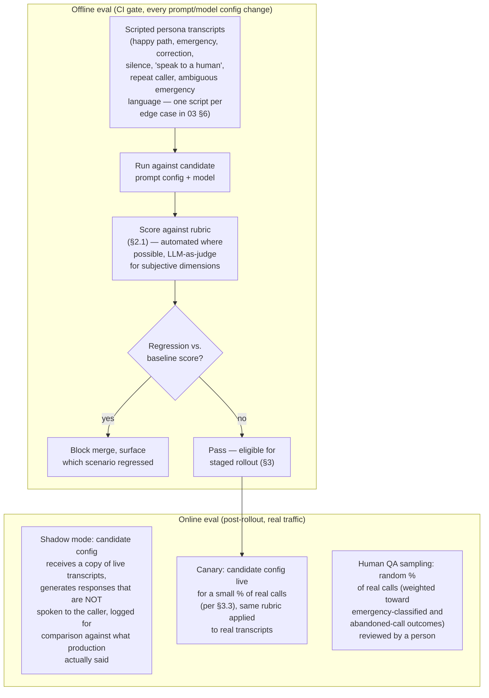
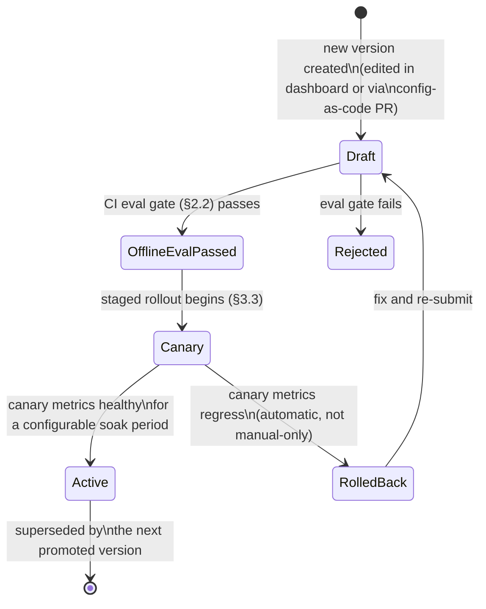
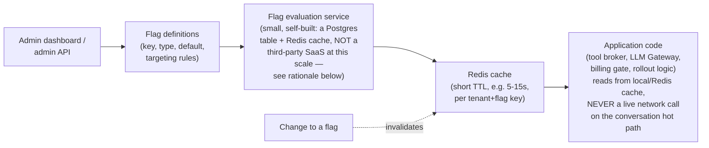

# 16 — AI Evaluation Framework, Prompt Versioning & Feature Flags

None of this was in the original brief. It should have been: a platform whose core product _is_ an LLM-driven conversation has no way to know whether a prompt change made things better or worse, or to safely roll one out, without these three pieces. Shipping prompt changes by "it sounded fine in a manual test call" does not scale past the first tenant and is exactly the kind of unmeasured, un-gated change process that produces the "robotic conversation" and "no proper closing script" failures this platform exists to fix.

## 1. Why this is a first-class architecture concern, not a prompt-engineering afterthought

The conversation engine ([03-conversation-engine.md](03-conversation-engine.md)) and the tool broker ([04-ai-tool-architecture.md](04-ai-tool-architecture.md)) are both **behavior defined by data** (prompt config, model choice, tool allowlist), not by a code deploy. That's a deliberate flexibility win — a tenant's emergency keywords or brand voice can change without an engineering ticket. But anything whose behavior changes without a code review needs its own equivalent of code review: an evaluation gate before a change ships, and a fast rollback if it doesn't work as expected in production. This doc is that equivalent.

## 2. AI evaluation framework

### 2.1 Scoring rubric (the concrete, checkable version of "don't sound robotic")

| Dimension                          | How it's scored                                                                                                         | Why it's in the rubric                                                                                                                                                               |
| ---------------------------------- | ----------------------------------------------------------------------------------------------------------------------- | ------------------------------------------------------------------------------------------------------------------------------------------------------------------------------------ |
| Field extraction accuracy          | Automated: does the transcript's final `qualification_data` match the scripted persona's ground-truth fields?           | Direct correctness — a missed/wrong address or phone number is the most costly possible error                                                                                        |
| Emergency classification accuracy  | Automated: compare `escalateEmergency` tool-call output against the scripted scenario's labeled severity                | Ties directly to the fail-safe-toward-escalation principle in [07](07-notification-and-emergency.md) §5.2 — false negatives here are the platform's single highest-risk failure mode |
| No scheduling/pricing promises     | Automated: regex/keyword + LLM-judge check that no committed time/price appears in AI turns                             | Direct architectural requirement, [03](03-conversation-engine.md) §4                                                                                                                 |
| No robotic full-sentence readback  | LLM-judge, calibrated against hand-labeled examples                                                                     | Directly targets the "robotic conversation" failure mode named in the original brief                                                                                                 |
| Name-spelling behavior correctness | Automated: only uncommon/low-STT-confidence names should trigger phonetic spell-back                                    | Targets the "doesn't ask to spell names" / over-spells-everything failure modes, [03](03-conversation-engine.md) §5                                                                  |
| Interruption handling              | Synthetic barge-in injected mid-scripted-response, checked that the AI doesn't repeat itself or ignore the interruption | [03](03-conversation-engine.md) §6                                                                                                                                                   |
| Closing script present             | Automated: every call-ending transcript must contain the closing template's required elements                           | Directly targets "no proper closing script"                                                                                                                                          |
| Brand voice compliance             | LLM-judge against the tenant's configured banned-phrase list                                                            | [03](03-conversation-engine.md) §4                                                                                                                                                   |

**LLM-as-judge risk, named explicitly rather than glossed over**: an LLM judge can drift, be gamed by a prompt that "looks good" to the judge model without being good for a real caller, or share blind spots with the model being judged (especially if judge and candidate are the same model family). Mitigation: (1) the judge model is deliberately a different model/vendor than the production conversation model where feasible, to avoid correlated blind spots; (2) automated/regex-based checks are used wherever a dimension can be checked deterministically (§2.1 table, "Automated" rows) rather than reaching for an LLM judge by default; (3) the human QA sampling in the online eval loop (§2, "Online") exists specifically as a check on judge drift — a sustained divergence between judge scores and human QA scores on the same calls is itself an alert-worthy signal, not just background QA.

### 2.2 CI gate

Referenced in [10-deployment-cicd.md](10-deployment-cicd.md) §2 as a distinct pipeline stage: any PR touching `prompt_config` templates, the LLM Gateway's model routing, or the tool registry runs the full offline eval suite and fails the build on a rubric-score regression against the current production baseline — the same seriousness as a failing unit test, not a manual "someone should probably check this."

## 3. Prompt versioning

### 3.1 Storage and promotion model

`agent_configs` (see [06-database-schema.md](06-database-schema.md)) already has a `version` column and an `is_active` flag — this section specifies the promotion workflow around it:

- **Config-as-code option, not mandatory**: prompt fragments (§1 in [03-conversation-engine.md](03-conversation-engine.md)) can be authored either through the dashboard (non-engineers editing tenant/business-level fragments) or as versioned files in the repo (platform-base fragment, which is genuinely code-review-worthy since it's the shared safety-rule layer every tenant inherits). Both paths converge on the same `agent_configs` row format and the same eval gate — the platform-base fragment simply goes through git + CI directly, while tenant/business fragments go through the dashboard's own save-as-draft-version flow, which triggers the same eval pipeline via an internal API call rather than a PR.
- **Rollback is instant and cheap by construction**: because `is_active` points at a specific immutable version row rather than the config being mutated in place, reverting a bad prompt change is flipping a pointer, not reconstructing a previous state from memory or a diff — this is the same "immutable version, pointer swap" pattern as the blue/green deploy strategy in [10](10-deployment-cicd.md) §3, applied one layer up at the config level instead of the infrastructure level.

### 3.2 Safety invariant enforcement across versions

The platform-base prompt fragment (shared safety/tool-use rules, [03](03-conversation-engine.md) §1) is schema-validated on save: a tenant/business-level fragment cannot override or delete the base fragment's safety rules (e.g. the scheduling/pricing prohibition), it can only _add_ brand-voice/vertical-specific content on top. This is enforced the same way the tool registry itself enforces "no scheduling tool exists" — structurally, at the config-assembly layer, not by trusting that no one edits a shared template incorrectly.

### 3.3 Staged rollout (canary)

A new prompt/model version promoted out of `Draft` doesn't go straight to 100% of a business's calls — it's exposed to a configurable percentage (default: 10%) of real calls for a soak period, with the online eval metrics (§2, "Canary") compared against the current active version's baseline. This uses the same feature-flag percentage-rollout mechanism as §4 below — prompt rollout is simply one more thing gated by a flag, not a separate mechanism.

## 4. Feature flags

### 4.1 Why the platform needs a real flagging system, not `if (tenantId === 'x')` scattered in code

Several already-specified capabilities depend on being able to change behavior for a subset of tenants/businesses/calls without a deploy: prompt/model canary rollout (§3.3), plan-tier gating ([15-tenant-lifecycle-billing-and-analytics.md](15-tenant-lifecycle-billing-and-analytics.md) §3.2), and — critically for reliability — an **operational kill-switch**: if a specific tool or CRM adapter starts misbehaving in production, on-call needs to disable it in seconds, scoped to one tenant or globally, without waiting on a deploy pipeline.

### 4.2 Architecture

- **Why self-built over a third-party flag SaaS (e.g. LaunchDarkly) at this stage**: the targeting dimensions needed (tenant, business, plan tier, percentage rollout) are exactly the dimensions the platform's own multi-tenant data model already has, and a self-built table + Redis cache is a few hours of work reusing infrastructure (Postgres, Redis) already mandatory for the rest of the platform — pulling in a third-party flagging vendor adds an external dependency (another vendor risk, another item in [08-security-observability-reliability.md](08-security-observability-reliability.md)'s dependency list) for a problem this codebase's existing tools already solve. This is explicitly a **revisit-if** decision, not a permanent one: if flag-evaluation logic grows complex (multivariate experiments, statistical significance testing for A/B tests) beyond simple percentage/attribute targeting, a dedicated vendor becomes worth the dependency cost — tracked as an open item in [20-architecture-decision-records.md](20-architecture-decision-records.md).
- **Hot-path latency constraint**: flag reads inside the voice-orchestrator's per-turn logic (e.g. "is the new prompt version active for this call?") must never be a live database or network call — evaluated once at call start from the Redis cache (itself refreshed on a short TTL or invalidated on write) and held in the call's in-memory session state for the call's duration, consistent with the sub-1-second latency budget in [02-voice-pipeline-and-telephony.md](02-voice-pipeline-and-telephony.md) §3.
- **Kill-switch requirement**: a flag flip must take effect within the Redis cache's TTL window (single-digit seconds), platform-wide, without a deploy — this is the concrete mechanism behind the "disable a misbehaving tool immediately" operational requirement referenced in [19-operational-runbooks.md](19-operational-runbooks.md).

### 4.3 Targeting dimensions

| Dimension                                          | Example use                                                                  |
| -------------------------------------------------- | ---------------------------------------------------------------------------- |
| Global                                             | Platform-wide kill-switch for a tool or CRM adapter                          |
| Tenant                                             | Beta feature for one pilot tenant before broader rollout                     |
| Business                                           | A/B testing two closing-script variants across a tenant's multiple locations |
| Plan tier                                          | Gating advanced emergency-rule customization to a higher plan                |
| Percentage (stable hash on call_id or customer_id) | Prompt/model canary rollout (§3.3)                                           |
