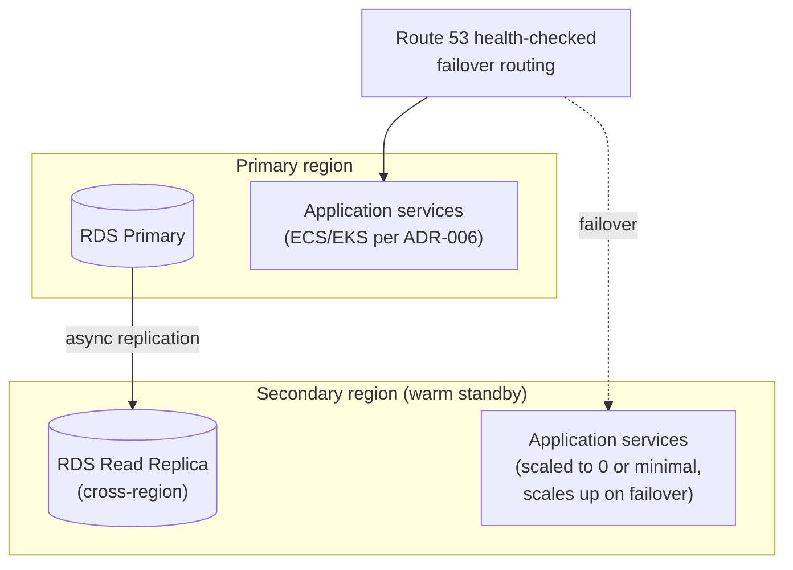

# 17 — Disaster Recovery, Multi-Region & Compliance

Not in the original brief, but a platform answering live phone calls for paying customers needs a stated answer to "what happens if a region goes down" and "what regulatory obligations does a voice-recording, PII-handling SaaS actually have" before the first real tenant goes live — deferring these to "later" is itself a risk decision, so it's made explicit here rather than by default.

## 1. Disaster recovery

### 1.1 Objectives

| Component                             | RPO (max acceptable data loss)                                                                                                                                                                                                                                                                                                                                          | RTO (max acceptable downtime)                                                                                                                                                                                                                                                                |
| ------------------------------------- | ----------------------------------------------------------------------------------------------------------------------------------------------------------------------------------------------------------------------------------------------------------------------------------------------------------------------------------------------------------------------- | -------------------------------------------------------------------------------------------------------------------------------------------------------------------------------------------------------------------------------------------------------------------------------------------- |
| PostgreSQL (leads, customers, config) | ≤5 min (RDS automated backups + point-in-time recovery, continuous transaction-log shipping)                                                                                                                                                                                                                                                                            | ≤30 min (restore from PITR to a new instance, or promote a standby in a Multi-AZ failure)                                                                                                                                                                                                    |
| Redis (session/queue state)           | Best-effort — an active call's in-memory conversation state is not disaster-recovered; a Redis-layer outage during a call is handled by the voice-reconnect pattern ([08-security-observability-reliability.md](08-security-observability-reliability.md) §3), not by Redis backup/restore, since a call's state has a lifetime of minutes, not a retention requirement | Queue jobs (BullMQ) are backed by Redis persistence (AOF); a full Redis loss mid-flight means in-flight (not yet completed) notification/CRM-sync jobs are replayed from the durable Postgres-side outbox/domain records they were derived from, not lost outright                           |
| S3 (recordings, transcripts)          | Near-zero (S3 versioning + cross-region replication)                                                                                                                                                                                                                                                                                                                    | N/A (S3 itself is multi-AZ durable; cross-region replication protects against a full-region event)                                                                                                                                                                                           |
| Full region loss                      | Bounded by RDS cross-region automated backup replication + Terraform-defined infrastructure                                                                                                                                                                                                                                                                             | Target: full environment rebuildable in a second region within hours via `terraform apply` against the DR region, not days of manual reconstruction — this is the concrete payoff of the "no manually-created infrastructure" principle in [10-deployment-cicd.md](10-deployment-cicd.md) §5 |

### 1.2 Backup & restore discipline

- **Automated is necessary but not sufficient** — the [12-production-readiness-checklist.md](12-production-readiness-checklist.md) gate already requires an actual restore-from-backup drill before go-live, not just confirming backups are configured. This doc adds the ongoing cadence: **a full restore drill runs on a recurring schedule (quarterly, tracked in [19-operational-runbooks.md](19-operational-runbooks.md))**, not only once at launch — a backup nobody has restored from recently is a hypothesis, not a guarantee.
- **Cross-region backup replication** for RDS and S3 is configured from Phase 1 (cheap — it's a checkbox on managed AWS services, not a build-it-yourself pipeline), even though the _compute_ to actually run a warm standby in a second region is a Phase 3 item (§2) — protecting the data is worth doing early; standing up parallel compute isn't, until multi-region is otherwise justified.

## 2. Multi-region strategy

### 2.1 Phase 1-2: single region, DR-ready

Single primary region (co-located with the voice vendor's nearest edge per [02-voice-pipeline-and-telephony.md](02-voice-pipeline-and-telephony.md)), with the backup replication in §1.2 as the DR safety net, but no live standby compute running. This is the right call while all tenants are in one geography — paying for warm standby compute with no tenant yet needing it is exactly the premature-scaling the [11-roadmap-risks-future.md](11-roadmap-risks-future.md) phasing is designed to avoid.

### 2.2 Phase 3 trigger: active-passive multi-region

**Trigger condition** (evidence-based, not calendar-based, consistent with the ADR-006 pattern in [20-architecture-decision-records.md](20-architecture-decision-records.md)): tenants with a meaningful concentration of call volume in a second geography where cross-region network latency would otherwise threaten the sub-1-second voice budget ([02](02-voice-pipeline-and-telephony.md) §3), or a specific enterprise tenant's contractual data-residency requirement.

- **Voice calls specifically**: since a phone call is inherently tied to whichever region's voice-vendor edge accepted it, region failover for _in-progress_ calls isn't meaningfully recoverable (a dropped call is a dropped call) — the DR objective for voice specifically is "new calls route to the healthy region within RTO," handled the same voice-reconnect/graceful-degradation way as any other voice-vendor incident ([08](08-security-observability-reliability.md) §3), not a novel mechanism.
- **Data residency**: a tenant requiring data to stay in a specific jurisdiction (e.g. an EU-based future tenant) is served by pinning that tenant's `business` row to a region-scoped deployment — the RLS + `tenant_id`/`business_id` scoping already in [06-database-schema.md](06-database-schema.md) is what makes "this tenant's data lives only in region X" an enforceable constraint rather than an operational promise.

### 2.3 Explicitly deferred: active-active

Active-active (writes accepted in multiple regions simultaneously) introduces real conflict-resolution complexity (e.g. two regions both creating a lead for the same call, or concurrent config edits) that this platform's traffic profile does not yet justify — flagged in [20-architecture-decision-records.md](20-architecture-decision-records.md) as a future decision to make with real cross-region-latency data, not a default to build toward speculatively.

## 3. Compliance

| Regime                                                    | Applicability                                                                                                                                                      | Design status                                                                                                                                                                                                                                                                                                                                                                                                                                                                                                                                                                                                                                                                                                                                                                                                                             |
| --------------------------------------------------------- | ------------------------------------------------------------------------------------------------------------------------------------------------------------------ | ----------------------------------------------------------------------------------------------------------------------------------------------------------------------------------------------------------------------------------------------------------------------------------------------------------------------------------------------------------------------------------------------------------------------------------------------------------------------------------------------------------------------------------------------------------------------------------------------------------------------------------------------------------------------------------------------------------------------------------------------------------------------------------------------------------------------------------------- |
| **GDPR / CCPA**                                           | Any tenant or their customers in the EU/California                                                                                                                 | Right-to-erasure workflow, PII tagging/redaction, soft-delete + hard-delete purge already designed in [08-security-observability-reliability.md](08-security-observability-reliability.md) §1.4                                                                                                                                                                                                                                                                                                                                                                                                                                                                                                                                                                                                                                           |
| **Call recording consent (state two-party-consent laws)** | Required in all-party-consent states (e.g. CA, FL, PA, WA, and others) whenever a call is recorded                                                                 | The greeting script ([03-conversation-engine.md](03-conversation-engine.md) §4/§7) includes a recording disclosure for any business operating in (or receiving calls from callers in) a two-party-consent state — **the safer, simpler default is to disclose recording in the greeting for every tenant regardless of state**, since a caller's own state (not just the business's) can determine which law applies to an interstate call, and a platform serving "hundreds or thousands" of businesses across state lines cannot safely assume single-state operation. This is enforced as a non-removable element of the platform-base prompt fragment ([16-ai-evaluation-prompt-versioning-feature-flags.md](16-ai-evaluation-prompt-versioning-feature-flags.md) §3.2's safety-invariant enforcement), not a tenant-optional toggle. |
| **TCPA**                                                  | Governs outbound calls/texts, especially automated ones                                                                                                            | Explicitly why outbound-calling features (callback confirmation calls, review-request texts) are deferred to Phase 4 in [11-roadmap-risks-future.md](11-roadmap-risks-future.md) — TCPA compliance (consent capture, do-not-call list checking, calling-hours restrictions) is a distinct compliance project that shouldn't be bolted onto a launch scoped for inbound-only calling. The `NOTIFICATIONS` channel's SMS use (§ in [07-notification-and-emergency.md](07-notification-and-emergency.md)) is to the _business's own staff_, who have an employment/operational relationship with the tenant, not to end consumers — meaningfully lower TCPA risk than a consumer-facing outbound text, but worth stating explicitly rather than assuming.                                                                                    |
| **PCI DSS**                                               | Payment card data                                                                                                                                                  | Out of scope by design — Stripe is the payment processor and billing system of record ([15-tenant-lifecycle-billing-and-analytics.md](15-tenant-lifecycle-billing-and-analytics.md) §3.1); no card data ever reaches Ethixweb's infrastructure.                                                                                                                                                                                                                                                                                                                                                                                                                                                                                                                                                                                           |
| **HIPAA**                                                 | Only relevant if the platform expands into a medical/dental front-desk vertical (mentioned as a future-roadmap possibility in [11](11-roadmap-risks-future.md) §3) | Explicitly **not** designed for in this blueprint — flagged so that if/when that vertical expansion is pursued, it's understood as requiring a dedicated compliance review (BAA with every vendor in the pipeline — voice vendor, LLM provider, hosting — plus additional encryption/audit requirements) rather than an assumed drop-in extension of the home-services design.                                                                                                                                                                                                                                                                                                                                                                                                                                                            |
| **SOC 2 Type II**                                         | Not legally required, but a de facto requirement for selling to larger home-service franchises/enterprises down the line                                           | Recommended to begin **control-observation from Phase 1** (audit logging, access reviews, change-management process, incident response — most of which this blueprint already specifies for other reasons: [08](08-security-observability-reliability.md), [19-operational-runbooks.md](19-operational-runbooks.md)) even though the formal audit engagement itself is a Phase 3+ business decision — a SOC 2 audit is dramatically cheaper and faster when the controls it's attesting to already existed for a year, versus retrofitting evidence after the fact.                                                                                                                                                                                                                                                                       |

### 3.1 Why this section exists as its own document rather than a paragraph in the security doc

Disaster recovery, multi-region, and compliance are grouped together deliberately: all three are "the platform is fine most of the time, and this is what happens on the bad day" concerns, distinct from [08-security-observability-reliability.md](08-security-observability-reliability.md)'s day-to-day security/observability/reliability patterns — worth a dedicated audit-able document rather than being diluted across a doc primarily about everyday operation.
