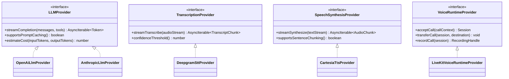

# 21 — AI/Telephony Provider Abstraction, Vendor Risk Register & Scale Stress-Test

## 0. Why this document exists — a genuine gap, not a restatement

[05-crm-integration.md](05-crm-integration.md) formalized `CRMAdapter` as a port with a real interface, contract tests, and an explicit "this is how a second CRM gets added" story. **The AI/voice layer never got the same treatment.** [02-voice-pipeline-and-telephony.md](02-voice-pipeline-and-telephony.md) picked LiveKit + Twilio/Telnyx and argued the choice well, and [14-backend-stack-and-code-standards.md](14-backend-stack-and-code-standards.md) mentions an "LLM Gateway" that does "model routing" — but nowhere is there an actual `LLMProvider` interface with the same rigor as `CRMAdapter`: a defined contract, a conformance test suite, and a stated story for "here is exactly what changes when a second LLM/STT/TTS/voice-runtime vendor is added." For a platform explicitly required to "support multiple AI providers" and "support multiple telephony providers" over a 2-5 year horizon, that's a real hole, not a nice-to-have — closing it here.

## 1. Provider ports

- **`LLMProvider`**: the LLM Gateway ([02](02-voice-pipeline-and-telephony.md) §3, [14](14-backend-stack-and-code-standards.md) §1) depends on this interface, never on a concrete OpenAI/Anthropic SDK client. Model routing ([09-cost-analysis.md](09-cost-analysis.md) §4's tiered-model cost lever) becomes "pick which `LLMProvider` implementation handles this turn," the same pattern as `CRMAdapter` selection by `crm_type`. Multi-provider isn't just a cost lever — it's the direct mitigation for the exact reliability risk named in [20-architecture-decision-records.md](20-architecture-decision-records.md) ADR-001 (a single LLM vendor's multi-disruption week has no fallback today); with this port in place, a **provider-level circuit breaker** (same pattern as the CRM adapter's, [08-security-observability-reliability.md](08-security-observability-reliability.md) §3) can fail over turn-taking to a secondary `LLMProvider` mid-outage, not just log an alert and hope.
- **`TranscriptionProvider` / `SpeechSynthesisProvider`**: same pattern for STT/TTS — the vendor comparison already treats these as swappable line items in the cost model ([09](09-cost-analysis.md) §4), but that swappability needs to actually exist in code as an interface, not just be true "in principle" because nothing hard-codes a vendor SDK deep in application logic.
- **`VoiceRuntimeProvider`**: this is the one most worth calling out, because it's easy to assume "we chose LiveKit, so this doesn't need an abstraction." It does — LiveKit itself is a vendor decision (ADR-001), and the whole point of ADR-001's honest trade-offs section (untuned latency, uptime trailing SLA) is that this decision might need revisiting with real production evidence. Without this port, "revisiting" means a rewrite of the voice-orchestrator; with it, it means a new adapter behind an interface the conversation state machine ([03-conversation-engine.md](03-conversation-engine.md) §2) never touches directly.

**Contract tests apply the same way as `CRMAdapter`**: every provider implementation is tested against a shared conformance suite (streaming token/audio chunks arrive in order, cost estimation is present, cancellation/barge-in stops the stream promptly) — [10-deployment-cicd.md](10-deployment-cicd.md) §2's contract-test stage gains four more suites, not a new testing philosophy.

**What does _not_ change**: this doesn't reopen ADR-001 — LiveKit + Twilio/Telnyx remains the Phase 1 pick, and OpenAI/Anthropic-class models remain the Phase 1 LLM choice. This document formalizes the _seam_ the future swap or failover happens through, so that when it's needed, it's a new adapter, not an architecture review.

## 2. Vendor risk register

The single table an external security auditor or a new staff engineer should be able to ask for and get immediately — every external dependency, why it's there, what happens if it fails or disappears, and where the decision is recorded:

| Vendor                                       | Role                                           | Criticality                                                                                   | Abstracted behind                                                                                                              | Fallback / mitigation                                                                                                                                                        | Decision record                                                                                                |
| -------------------------------------------- | ---------------------------------------------- | --------------------------------------------------------------------------------------------- | ------------------------------------------------------------------------------------------------------------------------------ | ---------------------------------------------------------------------------------------------------------------------------------------------------------------------------- | -------------------------------------------------------------------------------------------------------------- |
| LiveKit                                      | Voice agent runtime                            | Critical (hot path)                                                                           | `VoiceRuntimeProvider` (§1)                                                                                                    | Voice reconnect, synthetic canary, carrier-level fallback routing to a human line on confirmed outage                                                                        | [20](20-architecture-decision-records.md) ADR-001, [19-operational-runbooks.md](19-operational-runbooks.md) §2 |
| Twilio / Telnyx                              | SIP/PSTN carrier                               | Critical (hot path)                                                                           | Carrier is already a swappable trunk config, not code-coupled                                                                  | Dual-carrier trunk configuration is a documented Phase 3+ option if a single carrier's reliability becomes a recurring issue                                                 | [02](02-voice-pipeline-and-telephony.md) §2, §4                                                                |
| LLM provider (OpenAI/Anthropic-class)        | Conversation intelligence, tool-call decisions | Critical (hot path)                                                                           | `LLMProvider` (§1)                                                                                                             | Provider-level circuit breaker + secondary-provider failover (new capability enabled by §1's port)                                                                           | [20](20-architecture-decision-records.md) ADR-001 (voice layer only); this register's §1 (text-LLM layer)      |
| STT/TTS vendor(s)                            | Speech recognition/synthesis                   | Critical (hot path)                                                                           | `TranscriptionProvider`/`SpeechSynthesisProvider` (§1)                                                                         | Swappable per §1; cost/quality-tiered per [09](09-cost-analysis.md) §4                                                                                                       | This doc §1                                                                                                    |
| Housecall Pro (+ future CRMs)                | Customer/lead system of record                 | High (async, not hot-path — see [04](04-ai-tool-architecture.md) §3.3's graceful degradation) | `CRMAdapter`                                                                                                                   | Local-first lead persistence, background sync retry, circuit breaker                                                                                                         | [20](20-architecture-decision-records.md) ADR-002, [05-crm-integration.md](05-crm-integration.md)              |
| Stripe                                       | Billing system of record                       | High (not hot-path)                                                                           | Isolated to the `billing` module ([13-implementation-backlog.md](13-implementation-backlog.md))                                | Local mirror of subscription/plan state means a Stripe outage delays billing sync, not service delivery                                                                      | [20](20-architecture-decision-records.md) ADR-008                                                              |
| AWS (RDS, ECS/Fargate, ElastiCache, S3, KMS) | Core infrastructure                            | Critical                                                                                      | N/A — a cloud provider is not practically abstracted away for a company this size, and pretending otherwise would be premature | Multi-AZ, cross-region backups, DR plan                                                                                                                                      | [17-disaster-recovery-multi-region-compliance.md](17-disaster-recovery-multi-region-compliance.md)             |
| Redis (ElastiCache)                          | Cache, queues, session state, event bus        | Critical                                                                                      | BullMQ/Streams usage isolated to `shared/kernel` ([13](13-implementation-backlog.md))                                          | Voice-reconnect pattern for session state; durable domain records back the outbox so queue loss isn't data loss ([17](17-disaster-recovery-multi-region-compliance.md) §1.1) | [20](20-architecture-decision-records.md) ADR-007                                                              |

**Why a cloud provider (AWS) is intentionally _not_ abstracted, and that's a deliberate decision, not an oversight**: unlike CRM/LLM/voice vendors — where this platform's core value proposition explicitly depends on not being captive to one vendor's roadmap (the entire reason this project exists instead of using Housecall Pro's own AI) — multi-cloud abstraction for infrastructure primitives (RDS, S3, KMS) is a well-known trap that adds enormous ongoing complexity for a benefit ("we could move to GCP/Azure") that is rarely exercised in practice and is achievable later via Terraform-level infrastructure change if it's ever truly needed, without touching application code (the Hexagonal boundary already keeps AWS SDK calls out of the domain/application layers per [14](14-backend-stack-and-code-standards.md) §2). Flagged explicitly here so it reads as a considered trade-off, not a missed abstraction.

## 3. Stress-test: what breaks at 10x and 100x the Phase 3 scale model

Taking the [09-cost-analysis.md](09-cost-analysis.md) 10,000-calls/day model as the baseline, walked forward:

| Layer                                                | Breaks around                                                                                                      | Why                                                                                                                                                                                                                         | Mitigation already designed, and where                                                                                                                                                                                                                                                                                                                    |
| ---------------------------------------------------- | ------------------------------------------------------------------------------------------------------------------ | --------------------------------------------------------------------------------------------------------------------------------------------------------------------------------------------------------------------------- | --------------------------------------------------------------------------------------------------------------------------------------------------------------------------------------------------------------------------------------------------------------------------------------------------------------------------------------------------------- |
| Single Postgres primary                              | ~100x (millions of calls/day, write-heavy `tool_calls`/`transcripts` tables)                                       | A single primary's write throughput is the first hard ceiling in this architecture — RLS and partitioning help query performance, not primary write capacity                                                                | Declarative partitioning already in place ([06](06-database-schema.md) §4) makes tenant-range sharding (splitting the largest tenants onto dedicated primaries) an extension of existing structure, not a redesign — explicitly flagged as the next lever past read-replica scaling, not designed in detail until real write-throughput data justifies it |
| Redis Streams event bus                              | ~10x-100x depending on retention needs                                                                             | Memory-bound retention, single-cluster throughput ceiling                                                                                                                                                                   | Migration path to Kafka/NATS already an ADR with an honestly-scoped effort estimate, not a "one file change" — [20](20-architecture-decision-records.md) ADR-007                                                                                                                                                                                          |
| ECS Fargate task ceiling / orchestration flexibility | ~10x, or sooner if self-hosting the voice SFU                                                                      | Fargate task-count and networking flexibility limits, and no clean self-hosted-SFU story                                                                                                                                    | EKS migration trigger already defined with explicit conditions, not "if things get big" — [20](20-architecture-decision-records.md) ADR-006                                                                                                                                                                                                               |
| Single LLM provider throughput/availability          | Any scale, but more painful at 100x where a single provider incident affects a much larger share of total business | Concentration risk, not a throughput ceiling per se                                                                                                                                                                         | `LLMProvider` abstraction + provider-level circuit breaker (§1 of this doc) — this is the concrete answer to "what would an SRE question" about this specific layer                                                                                                                                                                                       |
| Tool broker rate limiter (Redis token buckets)       | ~100x, extremely high tenant count                                                                                 | Redis-based rate limiting at very high cardinality (thousands of tenants × dozens of tools) has a real, if distant, memory/throughput ceiling                                                                               | Not designed in detail at this stage — flagged here as a known future question rather than silently assumed away, consistent with not over-designing for a scale the platform isn't at yet                                                                                                                                                                |
| Notification fan-out (BullMQ)                        | ~10x-100x                                                                                                          | Job-per-lead dedup pattern ([07](07-notification-and-emergency.md) §2) scales with lead volume, which scales sub-linearly with call volume (most calls aren't emergencies) — lower-risk layer than the others in this table | Revisit only if notification volume specifically, not call volume generally, becomes the bottleneck                                                                                                                                                                                                                                                       |
| Multi-country / multi-currency billing               | Whenever the first non-US enterprise customer signs                                                                | Stripe supports this natively (multi-currency, Stripe Tax for VAT/GST) — the risk isn't technical, it's compliance (data residency, local telephony regulatory regimes like STIR/SHAKEN being US-specific)                  | [17](17-disaster-recovery-multi-region-compliance.md) §2's data-residency-by-business-pinning mechanism already generalizes to this; flagged as needing a dedicated compliance pass per new country, not a platform redesign                                                                                                                              |

**The honest point of this section**: none of these are surprises requiring a redesign today — every single one already has a designed mitigation or an explicitly-deferred, evidence-triggered plan elsewhere in this doc set. That's the actual bar for "survives 5 years": not that the Phase 1 build already handles 100x scale (it shouldn't, that would be the premature-optimization mistake ADR-006 explicitly called out), but that nothing in the Phase 1 design _forecloses_ the scaling path when the evidence to justify it arrives.

## 4. Multi-country expansion — what's genuinely different, not just "more of the same"

- **Telephony regulatory regimes are not globally uniform**: STIR/SHAKEN caller-ID attestation ([18-abuse-prevention-and-telephony-fraud.md](18-abuse-prevention-and-telephony-fraud.md) §4) is a US-specific framework; other countries have their own equivalents (or none). A `VoiceRuntimeProvider`/carrier abstraction (§1) that assumed STIR/SHAKEN attestation was universally available would break silently in a new country — the abuse-prevention design should treat attestation-checking as an optional, carrier-capability-gated signal, not a required one, when this expansion happens.
- **Two-party consent / recording-disclosure law varies globally, not just by US state** ([17](17-disaster-recovery-multi-region-compliance.md) §3) — the "disclose recording in every greeting regardless of jurisdiction" default already adopted there generalizes cleanly internationally, which is a point in its favor as a simple, robust default rather than a per-jurisdiction rules engine.
- **Data residency** is already designed as a per-business pinning mechanism ([17](17-disaster-recovery-multi-region-compliance.md) §2.2), which is the right primitive for country-level expansion, not just EU-vs-US.
- **Not designed here, and shouldn't be yet**: specific country-by-country compliance playbooks (a UK Ofcom-equivalent review, a specific EU member state's recording-consent nuance). Building these before a specific country launch is speculative work this project's own engineering principles reject — flagged as a required step at expansion time, not a gap in the current blueprint.
