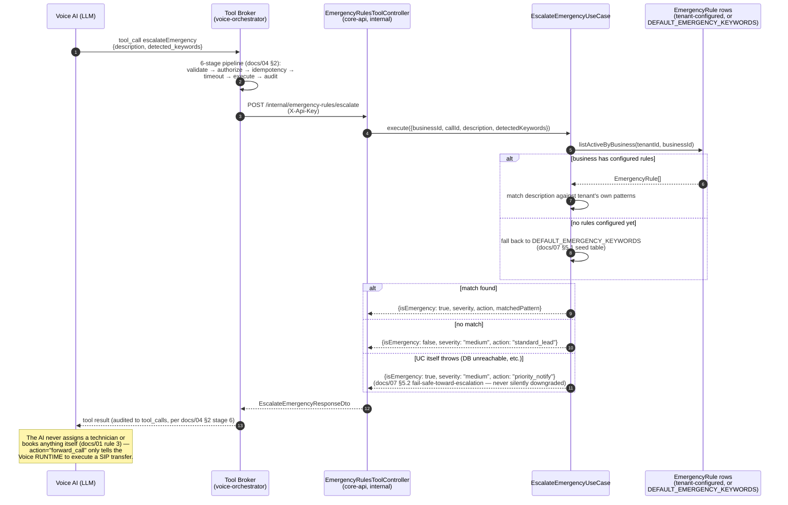
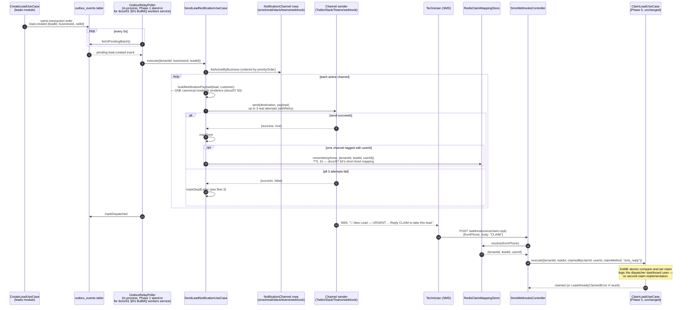
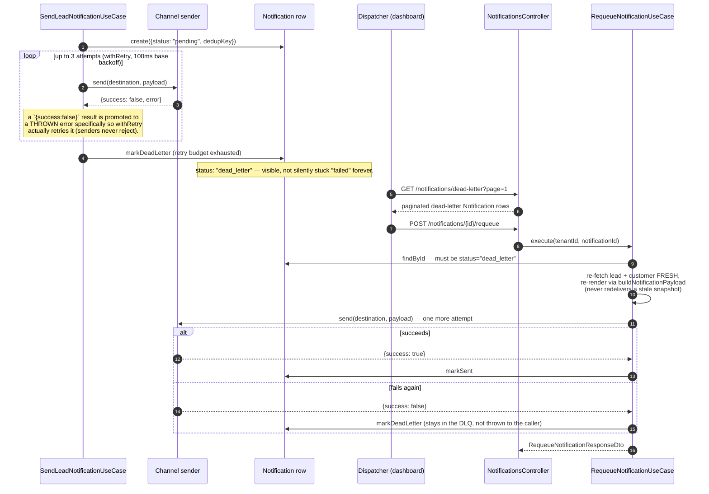

# 23 — Phase 7 Sequence Diagrams: Emergency Rules & Notification Engine

As-built documentation for what `apps/core-api/src/modules/emergency-rules` and
`apps/core-api/src/modules/notifications` actually implement (docs/07,
docs/13's `emergency-rules`/`notifications` module backlogs) — not a new
architecture proposal. Three flows: emergency escalation, lead notification
through to SMS claim, and the Dead Letter Queue's retry/redrive path.

## 1. Emergency escalation (docs/04 §3.8, docs/07 §5)

The Voice AI Orchestrator never decides severity itself — it calls the
`escalateEmergency` tool, which the Tool Broker routes to core-api's real
rule-matching engine over the internal tool-broker HTTP surface (API-key
auth, no `@Roles()` — see `EmergencyRulesToolController`'s own comment).

## 2. Lead created → notification fan-out → SMS "Reply CLAIM"

## 3. Notification retry → Dead Letter Queue → redrive

